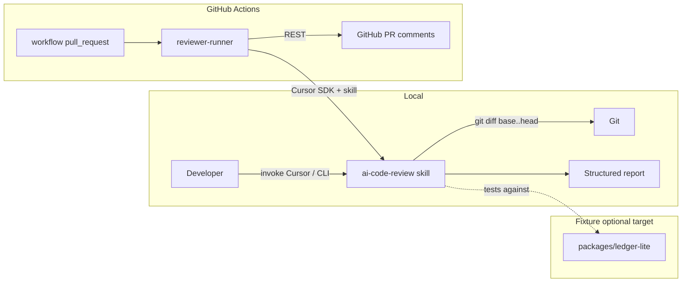

# MVP — AI Code Review (skill + fixture + GitHub pipeline)

## Product summary

Portfolio **AI code reviewer for GitHub**: a reusable **`ai-code-review` skill** holds all review logic; the same skill runs **locally** (developer invokes it against a diff) and **remotely** (CI on `pull_request` opened/synchronize via **Cursor SDK** + GitHub comment API).

**MVP success:** (1) v1 skill reads a branch diff, finds issues, emits a **structured report**; (2) a **non-functional fixture app** provides realistic volume for manual testing; (3) a **TypeScript runner** in GitHub Actions invokes the agent with the skill, parses output, and **posts review comments on the PR**.

Delivery order: **skill → local proof → fixture → runner + GitHub** — do not block skill work on CI.

## Scope

### In scope

| # | Deliverable | Notes |
|---|-------------|--------|
| 1 | **`ai-code-review` skill (v1)** | Simple pipeline: diff → analyze → structured report. No subagents, incremental review, or eval harness in v1. |
| 2 | **Local invocation path** | Developer can run review against `base...head` (or equivalent) and get the report on stdout / file. |
| 3 | **Fixture project** | **`packages/ledger-lite/`**: themed **React** frontend with enough files/lines to stress-test the skill; **no real product behavior** required. Intentionally uneven code quality optional later. |
| 4 | **`reviewer-runner` package** | TypeScript, compiles, used in CI: fetch PR diff context → `Agent.prompt` / `Agent.create` with skill → capture output → map to GitHub review/comments. |
| 5 | **GitHub Actions workflow** | Triggers on `pull_request` (`opened`, `synchronize`). Posts **inline PR review comments** via GitHub REST API. |
| 6 | **Repo layout & docs index** | Top-level paths documented in root `AGENTS.md`; this spec indexed in `.agents/AGENTS.md`. |

### Out of scope (MVP — explicit deferrals)

- Subagents, multi-pass review, incremental “only changed hunks since last run”
- Skill-owned **`prepare-diff`** script (normalized diff for agents) — runner owns diff in MVP
- Webhooks / long-running GitHub App server (Actions-only trigger is enough for MVP)
- Bitbucket / GitLab CI (hosting target is **GitHub** unless decision changes)
- GitHub App / dedicated bot identity (custom reviewer name) — post-MVP; MVP uses `github-actions[bot]`
- `evals/` golden cases, precision/recall metrics, post-filters from feedback data
- Functional fixture app, E2E tests, real database
- NestJS backend **unless** needed only for volume — default v1 fixture is **React-only** to limit scope
- Publishing skill to a global registry; monorepo-local skill is sufficient

## Behavior

### High-level architecture



### Skill `ai-code-review` (v1)

**Inputs (conceptual):**

- **MVP:** unified diff text produced by **`reviewer-runner`** (`git diff <base>...<head>`), injected into the prompt
- Optional: repo root `cwd`, PR metadata (number, title) for report header only
- **Later:** skill-invoked `prepare-diff` script for normalized, agent-friendly diff format

**Processing (v1 — intentionally shallow):**

1. Read and parse the unified diff (files, hunks).
2. Scan for **obvious issues** (examples for v1, not exhaustive): possible bugs, security smells, missing error handling, confusing naming, large risky changes — **heuristic / single-pass**, no specialized analyzers yet.
3. Write a **JSON report file** in the repo (see path below) with `findings[]` (`problem`, `suggestion`, `file`, `line`).

**Output contract (v1):**

- **File path (default):** `.ai-code-review/findings.json` at repo root (add to `.gitignore`).
- **Same path** for local runs and CI — developer iterates on the file; pipeline reads it after the agent finishes.
- **Schema:**

```json
{
  "version": "1",
  "findings": [
    {
      "severity": "info|warning|error",
      "file": "path/from/repo/root",
      "line": 42,
      "problem": "what is wrong",
      "suggestion": "how to fix it"
    }
  ]
}
```

- The skill is responsible for **creating/overwriting** this file; the runner does **not** parse free-form agent text in MVP.
- `line`: **required** for findings the runner will publish (inline-only MVP; skip findings without a resolvable line).
- Runner reads the file → maps each finding → **one inline review comment** on the PR diff (no PR-level summary comment).
- **GitHub comment body template** (markdown):

  ```
  *Problem*
  {problem}

  Suggested fix: *{suggestion}*
  ```

**Invocation:**

- **Local:** Cursor Agent with skill attached (or documented CLI wrapper that shells to SDK) against repo `cwd`.
- **CI:** `reviewer-runner` uses Cursor SDK (`Agent.prompt` one-shot acceptable for MVP) with the same skill path/repo context.

### Fixture project

**Purpose:** realistic target for diffs and PRs **inside this repo** (or a branch that only touches `packages/ledger-lite/`), without building a real product.

**Location — `packages/ledger-lite/` (npm workspace package):**

- Theme: **personal finance dashboard** (generic domain, easy to fake screens).
- Stack: **React 18 + TypeScript + Vite**, folder structure mimicking a small product (`src/pages`, `src/components`, `src/hooks`, `src/api` with mock modules).
- Volume target: **~30–50 source files**, **~3k–8k LOC** (adjust in implementation; enough for meaningful diffs).
- No backend in v1; `src/api/*.ts` returns hardcoded fixtures.
- Not required to run/build in CI for MVP unless useful for “smoke” — **build optional**, presence of code is the goal.

**Alternatives (if human prefers):**

| Option | Pros | Cons |
|--------|------|------|
| `packages/ledger-lite/` (chosen) | Same PR workflow; colocated with `reviewer-runner` under `packages/` | Fixture churn in monorepo history |
| Separate `bugbot-fixture` repo | Cleaner separation | More setup, cross-repo PR testing |
| Fork of public sample app | Fast | License noise, less tailored issues |

### `reviewer-runner` (CI package)

**Responsibilities:**

1. Resolve PR base/head SHAs (from `GITHUB_EVENT_PATH` or env).
2. Run `git diff <base>...<head>` and pass the result into the agent prompt (skill does not own diff extraction in MVP).
3. Call Cursor SDK with **`ai-code-review` skill** enabled.
4. Read `.ai-code-review/findings.json` → validate schema.
5. Post to GitHub: **inline review comments only** (one per finding with valid `file` + `line`), using the Problem / Suggested fix template.

**Runtime:** TypeScript, Node 20+, compiled output consumed by Actions (`node dist/...` or `npx tsx` for MVP only if plan allows).

### GitHub integration (MVP)

- Trigger: `pull_request` types `opened`, `synchronize`.
- Permissions: `pull-requests: write`, `contents: read` (adjust per comment API choice).
- **Success criterion:** at least one **inline** review comment on the PR diff, body matching the Problem / Suggested fix template, traceable to a structured finding.

**Auth (MVP):** workflow `GITHUB_TOKEN` with `permissions: pull-requests: write`.

- **Visible author:** [`github-actions[bot]`](https://github.com/apps/github-actions) — not your personal user, not a custom-named bot unless you switch to App/PAT later.
- Avatar/link on each inline comment point to that bot user.

### Recommended repo layout (target)

```
bugbot-application/
├── .agents/
│   ├── skills/              # SDD workflow (brainstorm, plan, …)
│   └── specs/
├── skills/
│   └── ai-code-review/
│       └── SKILL.md
├── packages/
│   ├── reviewer-runner/     # SDK + GitHub publisher (workspace)
│   └── ledger-lite/         # React fixture app (workspace)
├── .github/
│   └── workflows/
│       └── ai-code-review.yml
├── package.json             # npm workspaces root (`packages/*`)
└── AGENTS.md
```

- **npm workspaces:** two packages — `reviewer-runner`, `ledger-lite`. Product skill at **`skills/ai-code-review/`** (not an npm package).
- SDD skills stay in **`.agents/skills/`**.

### Implementation sequence (for `/plan` phases)

1. **Skill skeleton** — `SKILL.md` with v1 workflow, output schema, examples.
2. **Local smoke** — run against a hand-made diff or small branch in this repo.
3. **Fixture scaffold** — generate themed React tree; optional intentional smells in a follow-up branch.
4. **Runner package** — SDK call + JSON parse (unit-test parser with fixtures).
5. **GitHub workflow** — wire secrets (`CURSOR_API_KEY`), post comments, document in README fragment.

## API / events

| Surface | Contract |
|---------|----------|
| **Skill** | Writes `.ai-code-review/findings.json`; documented in `skills/ai-code-review/SKILL.md`. |
| **Report file** | `.ai-code-review/findings.json` — consumed locally and by `reviewer-runner` after agent run. |
| **Cursor SDK** | `Agent.prompt` or `Agent.create` + `send`; `local: { cwd }` and/or `cloud` — TBD in plan. |
| **GitHub** | Actions `pull_request` webhook payload; REST: **pull request review** with inline comments (Problem / Suggested fix body). |
| **CLI (optional MVP)** | Thin `pnpm review --base main --head HEAD` wrapping runner locally — defer if Cursor-only local path is enough initially. |

## Acceptance criteria

- [x] `skills/ai-code-review/SKILL.md` exists and describes the v1 flow (diff → findings → structured report).
- [x] **Local:** A documented command or Cursor flow produces **`.ai-code-review/findings.json`** for a diff between two branches in this repo.
- [x] **Fixture:** `packages/ledger-lite/` contains a React+TS tree meeting the volume target; no functional requirements beyond “code exists.”
- [x] **Runner:** `packages/reviewer-runner` builds with TypeScript; unit test reads a sample `.ai-code-review/findings.json` and maps `findings[]` to inline comment payloads.
- [ ] **CI:** On a test PR, workflow runs without manual steps, invokes the agent with the skill, and **at least one inline review comment** appears with `*Problem*` + `Suggested fix:` format.
- [x] Secrets documented: `CURSOR_API_KEY` required; GitHub token strategy documented in spec resolution or README.
- [x] Root `AGENTS.md` lists `skills/`, `packages/` (runner + ledger-lite), `.github/workflows/`.

## Validation checklist

- [ ] Acceptance criteria above are met
- [ ] `npm test` (or workspace equivalent) passes for `reviewer-runner` parser tests
- [ ] Manual local run recorded once (command + sample redacted output in PR or plan notes)
- [ ] Test PR in GitHub shows bot/agent comment linkage to structured report
- [ ] No open questions marked `Open` block release unless explicitly `Deferred` with owner
- [ ] Out-of-scope items (subagents, evals, Bitbucket) not partially implemented without spec update

## Open questions

| # | Question | Status | Answer / decision |
|---|----------|--------|-------------------|
| 1 | **GitHub vs Bitbucket:** User message mentioned PR on Bitbucket; rest assumes GitHub. Confirm hosting. | Resolved | **GitHub only** for MVP (Bitbucket was a slip; out of scope). |
| 2 | **Skill location:** `skills/ai-code-review/` (repo root) vs `.cursor/skills/` vs `.agents/skills/`? | Resolved | **`skills/ai-code-review/`** at repo root (product skill); `.agents/skills/` remains SDD only. |
| 3 | **Fixture theme/name:** OK with `ledger-lite` finance dashboard, or another domain? | Resolved | **`packages/ledger-lite/`**: personal finance dashboard mock (npm workspace package). |
| 4 | **Fixture stack:** React-only (MVP) or add NestJS stub API for volume? | Resolved | **React-only** (Vite + TS); mock APIs in `ledger-lite/src/api/`. No NestJS in MVP. |
| 5 | **CI SDK runtime:** `local` runner in Actions checkout vs `cloud` VM? | Resolved | **`local`** in CI = agent runs on the Actions runner with repo checked out at `cwd`. Agent *can* run git / read files if the skill allows; not limited to diff-only. Prefer full git history in workflow (`fetch-depth: 0`) if exploration is needed. |
| 6 | **Diff ownership:** Inject `git diff` text into prompt vs let agent run git? | Resolved | **MVP:** `reviewer-runner` runs `git diff <base>...<head>` and injects result into the agent prompt. **Later:** skill-owned `prepare-diff` script (agent-friendly format) — deferred post-MVP. |
| 7 | **GitHub comment shape:** single review with comments vs one summary + N line comments? | Resolved | **Inline comments only** (no PR summary). Body: `*Problem*` + problem text + `Suggested fix: *{suggestion}*`. One comment per finding with valid line. |
| 8 | **GitHub auth for MVP:** `GITHUB_TOKEN` vs GitHub App vs dedicated bot PAT? | Resolved | **`GITHUB_TOKEN`** from the workflow. Comments/reviews authored as **`github-actions[bot]`** (built-in Actions identity for this repo). |
| 9 | **Dedicated GitHub bot account:** needed for portfolio demo, or Actions bot sufficient? | Resolved | **MVP:** `github-actions[bot]` is enough. **Post-MVP:** GitHub App (or dedicated bot identity) with custom name/avatar — explicit follow-up, not blocking MVP. |
| 10 | **Structured output enforcement:** JSON-only response vs markdown fence parsing? | Resolved | Skill **writes `.ai-code-review/findings.json`** in the repo. Runner reads file after agent completes (local + CI). No stdout/fence parsing in MVP. |
| 11 | **Monorepo tool:** npm/pnpm workspaces from day one? | Resolved | **npm workspaces** — two packages: `packages/reviewer-runner`, `packages/ledger-lite`. Root `package.json` with `workspaces: ["packages/*"]`. |
| 12 | **Target repo for first CI test:** this repo only, or also external consumer repos? | Resolved | **This repo only** (`bugbot-application`). Workflow and test PRs run here; external repos post-MVP. |

_Status: `Open` · `Deferred` · `Resolved`_

## Changelog

| Date | Author | Change |
|------|--------|--------|
| 2026-05-30 | brainstorm | Initial MVP spec: skill-first, fixture, runner, GitHub Actions |
| 2026-05-30 | brainstorm | Q1 resolved: GitHub only (Bitbucket out of scope) |
| 2026-05-30 | brainstorm | Q2 resolved: `skills/ai-code-review/` at repo root |
| 2026-05-30 | brainstorm | Q3 resolved: `ledger-lite/` finance fixture at repo root (no `fixtures/`) |
| 2026-05-30 | brainstorm | Q4 resolved: React-only fixture (Vite + TS, mock APIs) |
| 2026-05-30 | brainstorm | Q5 resolved: SDK `local` runtime in Actions (full checkout; git exploration possible) |
| 2026-05-30 | brainstorm | Q6 resolved: runner runs `git diff` in MVP; `prepare-diff` script deferred to skill later |
| 2026-05-30 | brainstorm | Q7 resolved: inline-only PR comments; Problem + Suggested fix template |
| 2026-05-30 | brainstorm | Q8 resolved: `GITHUB_TOKEN`; author `github-actions[bot]` |
| 2026-05-30 | brainstorm | Q9 resolved: custom bot/App deferred post-MVP; Actions bot for MVP |
| 2026-05-30 | brainstorm | Q10 resolved: skill writes `.ai-code-review/findings.json`; runner reads file |
| 2026-05-30 | brainstorm | Q11 resolved: npm workspaces; `ledger-lite` under `packages/` |
| 2026-05-30 | brainstorm | Q3 updated: `packages/ledger-lite/` (was repo root) |
| 2026-05-30 | brainstorm | Q12 resolved: CI scope = this repo only |
| 2026-05-30 | brainstorm | All open questions resolved — ready for `/plan` |
| 2026-05-30 | implement | MVP codebase: skill, ledger-lite fixture, reviewer-runner, Actions workflow |
