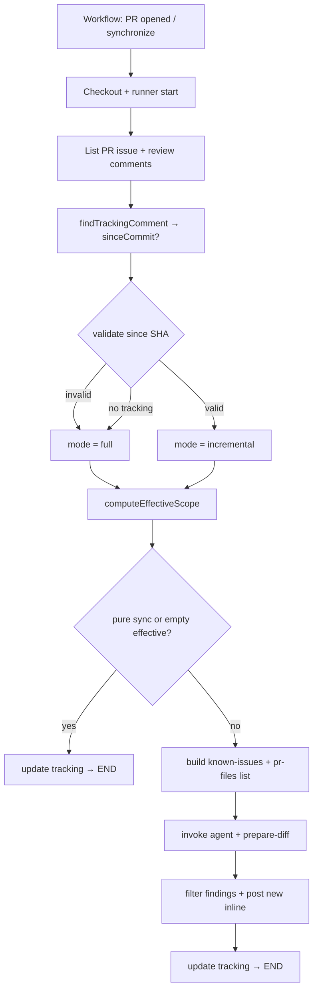

# Incremental AI code review (PR tracking + scoped diffs)

## Product summary

Extend the GitHub PR reviewer so each push does **not** re-analyze the entire PR from scratch. A **tracking comment** on the PR records the last successfully analyzed commit; subsequent runs review only **new changes since that commit**, scoped to files that belong to the PR. When there is nothing meaningful to review (merge-only sync with base, or no new PR-scoped file changes), the runner **skips the agent** but still **updates the tracking comment** to the current head commit.

State lives **on the PR** (no external database). Inline findings are **deduplicated** against existing review comments so pushes do not spam duplicate threads. Rebase, squash, or invalid history forces a **full review** fallback. The tracking comment **must be updated** after every successful review or **skip** on `pull_request` `synchronize`. It **must not** advance if the agent run fails (see **Tracking advance rules**).

## Scope

### In scope

| # | Area | Notes |
|---|------|--------|
| 1 | **Tracking comment (GitHub)** | Non-inline PR conversation comment with a stable marker and parseable fields; create or update on every run. |
| 2 | **Execution modes** | `full` (no tracking / invalid since-SHA) vs `incremental` (valid since-SHA ancestor of head). |
| 3 | **Git scope (runner)** | Compute `prFiles`, `incrementalFiles`, `effectiveFiles`; skip agent when pure sync or empty effective scope. |
| 4 | **SHA validation** | `git cat-file`, `git merge-base --is-ancestor`; shallow-clone recovery via fetch when needed. |
| 5 | **Known issues + dedup** | Build from existing inline PR review comments; runner/skill must not re-post the same `(file, line)`. |
| 6 | **`prepare-diff` (skill-owned)** | Deterministic incremental diff: `--since-commit`, `--pr-files`, ignore patterns, metadata (`is_incremental`, warnings). |
| 7 | **Agent prompt contract** | Pass branches, head SHA, optional since-SHA, paths to known-issues JSON and PR file list; skill uses `prepare-diff` instead of raw full-PR diff when incremental. |
| 8 | **Post-review** | Filter findings to `prFiles`; post only new inline comments; update tracking per **advance rules**. |
| 9 | **`reviewer-runner` + workflow** | Extend existing package and `ai-code-review.yml` (`opened`, `synchronize`); `fetch-depth: 0` retained. |
| 10 | **Tests** | Unit tests for tracking parse/write, scope/skip rules, SHA validation (mocked git where needed). |
| 11 | **Diff run summary logging** | Agent running the skill **always** emits a fixed multi-line summary after `prepare-diff` (incremental mode, stats, exclusions). |

### Out of scope

- Bitbucket / GitLab adapters
- External DB or object store for review state
- Subagents, multi-pass analyzers, or `evals/` harness (unchanged deferrals from MVP)
- GitHub App / custom bot identity (still `github-actions[bot]` unless decided later)
- Auto-resolving or deleting old inline comments when code changes
- PR-level summary review body (MVP remains inline-only for findings; tracking comment is separate)
- Publishing skill to a global registry

## Behavior

### Responsibility split

| Layer | Responsibility |
|-------|----------------|
| **GitHub Actions workflow** | Trigger on PR `opened` / `synchronize`; checkout with full history; env SHAs (`GITHUB_BASE_SHA`, `GITHUB_HEAD_SHA`, head commit for tracking). |
| **`reviewer-runner` (orchestration)** | Fetch PR comments; find/update tracking; validate since-SHA; compute scope and skip; build known-issues + PR file list; invoke agent; filter/post inline comments; update tracking per **advance rules**. |
| **`ai-code-review` skill + `prepare-diff`** | Produce agent-facing diff and metadata; **emit mandatory diff run summary** to logs; run analysis; write `.ai-code-review/findings.json`; warn on full-review fallback when incremental was requested. |

Review logic stays in the skill; the runner owns **integration, scope, tracking, dedup, and posting**.

### Tracking comment (source of truth)

- **Where:** one **issue comment** on the PR (conversation), **not** an inline review comment.
- **Marker line (exact):** `< ai-review-tracking >`
- **Parsed fields (regex-friendly lines below the marker):**
  - `Analyzed up to: <full-sha>`
  - `At: <ISO-8601 timestamp>`
- **Deferred:** `Reviewer: <version>` — not emitted in v1; may be added later for incompatible rule changes.
- **Selection:** if multiple comments contain the marker, use the one with the **latest `At` timestamp**.
- **Write:** when **advance rules** allow (see below):
  - If a tracking comment already exists for this bot/run → **update** it in place (`issues.updateComment`).
  - Else → **create** new (`issues.createComment`).
- **Commit recorded:** current PR **head** SHA for this workflow run (`GITHUB_HEAD_SHA` / `pull_request.head.sha`), not base branch tip.

#### Tracking advance rules (v1)

| Outcome | Advance tracking to current head? |
|---------|-----------------------------------|
| **Skip** (pure sync or empty `effectiveFiles`) | **Yes** |
| **Agent success** (`findings.json` read/validated after run) | **Yes** (even if `findings` is empty or post step posts 0 comments) |
| **Agent failure** (SDK error, timeout, missing/invalid `findings.json`) | **No** — keep previous `Analyzed up to`; next `synchronize` retries from last good SHA |
| **Post to GitHub fails** after successful agent | **No** (treat as failed run for tracking; optional retry of post only is out of scope for v1) |

On skip paths, tracking **must** still advance on each `synchronize` push.

### Execution modes

| Condition | Mode |
|-----------|------|
| No tracking comment on PR | **Full review** |
| Tracking present and `Analyzed up to` SHA exists and is ancestor of current head | **Incremental** |
| Tracking present but SHA missing, unknown, not ancestor (rebase/squash/shallow) | **Full review** (after optional fetch retry) |

**SHA validation (runner):**

1. `git cat-file -e <sha>`
2. `git merge-base --is-ancestor <sha> HEAD` (head = PR branch checkout)
3. On shallow failure: `git fetch origin <sha>` and/or `git fetch --deepen=200`, then retry.

### Git scope (runner, before agent)

Define three file sets (paths relative to repo root):

- `prFiles` = `git diff --name-only <base>...<head>` (three-dot: PR-scoped changes vs merge base)
- `incrementalFiles` = `git diff --name-only <sinceCommit>..<head>` (two-dot: changes since last analyzed commit)
- `effectiveFiles` = `incrementalFiles ∩ prFiles`

**Skip agent (no `Agent.send`) when:**

| Rule | Detection | On skip |
|------|-----------|---------|
| **Pure sync** | Since `sinceCommit`, no non-merge commits on first-parent: `git log --no-merges --first-parent <since>..<head>` empty (only merges/sync with target) | Update tracking to current head; exit 0; 0 new inline posts |
| **Empty effective scope** | `effectiveFiles` is empty | Same as above |

In both cases: **do not** invoke the agent; **do** update tracking to current head SHA.

### Agent / skill inputs

The runner passes (prompt and/or temp files):

| Input | When |
|-------|------|
| Source branch, target branch, current head SHA | Always |
| `Since commit: <sha>` | Incremental mode only |
| Path to **known issues** JSON | Always in CI (may be `[]`) |
| Path to **PR files** list (`prFiles`, complete) | Always |
| Path to **findings** output | `.ai-code-review/findings.json` (unchanged) |

**Known issues JSON** (runner-built from inline review comments): `{ "issues": [{ "file", "line", "message" }] }` with **full** comment body text (no truncation in v1). Used to suppress duplicate inline posts and as agent hints.

The runner **does not** pass `effectiveFiles` as a separate list; skip logic uses the intersection; `prepare-diff` applies `--since-commit` and `--pr-files`.

### Local invocation (`/ai-code-review` in Cursor)

| Context | How `since` is determined | Incremental? |
|---------|---------------------------|--------------|
| **GitHub Actions** (`reviewer-runner`) | Tracking comment on PR → validate SHA → pass `Since commit` to agent | Yes, when tracking valid |
| **Local Cursor** (`/ai-code-review`) | **Only** if the human supplies `Since commit: <sha>` in the invocation (prompt/skill args) | Yes, when SHA provided and valid |
| **Local Cursor** without `Since commit` | N/A | **No** — full review (`prepare-diff` from merge-base only) |

- No local tracking file, no GitHub API, and no runner-emulated tracking in v1 for IDE use.
- With `Since commit`, the skill runs `prepare-diff` with `--since-commit` (and should still scope to PR files when the invoker provides target/base or a PR file list; if omitted locally, diff is since-SHA vs `HEAD` with ignore patterns only).
- **Out of scope for local v1:** runner CLI flags that fake PR tracking; `npm run review` locally without CI remains **full PR diff** unless later extended.

### `prepare-diff` (skill)

Script lives under the skill (e.g. `.cursor/skills/ai-code-review/scripts/prepare-diff.ts` or equivalent). Steps:

1. Resolve `merge_base` with target branch.
2. If `--since-commit` provided and is ancestor of source head → `diffBase = sinceCommit`, `is_incremental = true`.
3. Else → `diffBase = merge_base`, `is_incremental = false`, emit warning metadata.
4. `git diff --name-only` with `diffBase...source` (three-dot) and `--diff-filter=ACMR` → filter:
   - paths not in `--pr-files` (drop merge noise from target)
   - ignored paths per **Ignore patterns (v1)** below
5. Emit structured payload (JSON default): per-file diffs + metadata (`is_incremental`, `since_commit`, `diff_base`, `merge_base`, `pr_size`, `files_excluded`, `excluded_patterns_matched`, `warnings[]`).

**Skill rule:** if prompt requested incremental but `metadata.is_incremental === false`, log a clear warning (`full review fallback`).

**Implementation note:** v1 script is **rewritten** under the skill (TypeScript, repo conventions); use prior art only for behavior, not a file-for-file port.

### Diff run summary (mandatory logging)

After **`prepare-diff`** completes and **before** analyzing the diff, the **agent executing the skill** must print the following block to **stdout** (visible in Cursor and in CI via streamed agent logs). Values come from `prepare-diff` metadata (`is_incremental`, `since_commit`, `diff_base`, `total_files`, `total_lines_added`, `total_lines_removed`, `files_excluded`). This is **not** optional.

**Incremental run** (`metadata.is_incremental === true`):

```text
Incremental: yes (since <full-sha>)
Diff stats: <n> files, +<added>/-<removed>
Excluded: <files_excluded> files
```

**Full review** (`metadata.is_incremental === false`):

```text
Incremental: no (base <full-sha>)
Diff stats: <n> files, +<added>/-<removed>
Excluded: <files_excluded> files
```

- `<full-sha>` for incremental = `since_commit`; for full = `diff_base` (merge-base or fallback base).
- Counts reflect **reviewable** files after PR-scope and ignore filters (same set passed to analysis).
- If `prepare-diff` emitted warnings (e.g. full-review fallback), log them **immediately after** this block as separate lines prefixed with `Warning:`.
- **`reviewer-runner`:** does not replace this block; may add its own `[review]` lines for orchestration (mode, skip). On **agent skip** paths, runner logs skip reason instead; the summary block is not required because the agent did not run.

**Skill checklist addition:** run `prepare-diff` → print summary block → analyze → write `findings.json`.

#### Ignore patterns (v1) — resolved

Hardcoded regex list in `prepare-diff` (no `.ai-review-ignore` in v1). Categories:

| Category | Examples / intent |
|----------|-------------------|
| Lockfiles | `yarn.lock`, `package-lock.json`, `pnpm-lock.yaml`, `.pnp.*` |
| Build output | `dist/`, `build/`, `.next/`, `out/`, `*.min.js`, `*.min.css` |
| Test artifacts | `*.snap`, `coverage/`, `.nyc_output/` |
| IDE / editor | `.vscode/`, `.idea/`, swap files, `.DS_Store` |
| Logs | `*.log`, `logs/` |
| Generated | `__generated__/`, `generated/`, `schema.prisma` |
| Binary / media | `png`, `jpg`, `gif`, `ico`, `svg`, fonts, `pdf`, archives |
| Low-signal config | `.gitignore`, `.editorconfig` |
| DB migrations (generated SQL) | `migrations/**/*.{js,ts,sql}` |

Metadata must record `files_excluded` and which pattern sources matched (for debugging). Revisit `.ai-review-ignore` only if a repo needs exceptions.

#### Other `prepare-diff` heuristics (from reference, not optional for v1)

- `merge-base`: try `origin/<target>` then bare `<target>`.
- Git I/O: raise `maxBuffer` for large diffs (order of 10 MiB).
- Per-file diffs: parallel with bounded concurrency (~10); warn and continue on single-file failure.
- `pr_size` hint in metadata: `small` ≤10 files and ≤500 lines changed; `large` if >30 files and >5000 lines; else `medium`.

### After agent (runner)

1. Read `.ai-code-review/findings.json`.
2. Drop findings whose `file` ∉ `prFiles`.
3. Drop findings that match known inline comment `(file, line)` (and optionally same normalized message).
4. Post remaining as **new** inline review comments (existing MVP format). **No severity threshold in v1** — all findings with `file` + `line` are eligible (same as MVP); revisit `warning`+ or env flag later.
5. Update tracking per **advance rules** (success or skip only).

### End-to-end flow



### Design decisions (fixed for this feature)

1. **Externalized state** on the PR (tracking comment), not in CI cache or DB.
2. **Two scope layers:** runner avoids useless agent runs; `prepare-diff` bounds what the agent sees.
3. **Merge/sync with base** does not count as new PR code (pure-sync skip).
4. **History rewrite** invalidates incremental → automatic full review.
5. **Dedup** via known issues + post filter (validator may live in runner initially; skill may consume known-issues for analysis hints—runner owns post dedup).
6. **Tracking advances** on skip and successful agent runs; **does not advance** on agent failure (option C).

## API / events

### GitHub

| API | Use |
|-----|-----|
| `GET .../issues/{pr_number}/comments` | Find/create/update **tracking** issue comment |
| `PATCH .../issues/comments/{comment_id}` | Update existing tracking comment |
| `GET .../pulls/{pr_number}/comments` | List **inline** review comments for known-issues |
| `POST .../pulls/{pr_number}/reviews` | Post new inline comments (existing MVP) |

### Workflow

- **Trigger:** `pull_request` types `opened`, `synchronize` (unchanged).
- **Env:** `GITHUB_BASE_SHA`, `GITHUB_HEAD_SHA`, `GITHUB_SHA` (document which SHA is used for tracking—prefer **head**), `GITHUB_TOKEN`, `GITHUB_EVENT_PATH`, `CURSOR_API_KEY`.

### Runner CLI (extensions)

| Flag / behavior | Purpose |
|-----------------|--------|
| `--skip-agent` | Internal/tests: scope + tracking only |
| Existing `--dry-run` | No GitHub post; may still print tracking payload |

Incremental **local** testing is via **`/ai-code-review` + `Since commit`**, not via runner `--since` in v1.

## Acceptance criteria

- [ ] On first PR run (no tracking comment), a full review runs and a tracking issue comment is created with marker, head SHA, and timestamp.
- [ ] On a second push with only new commits on PR branch files, incremental mode runs; agent receives diff since previous tracking SHA, scoped to `prFiles`.
- [ ] After incremental run, tracking comment shows updated `Analyzed up to` matching latest `GITHUB_HEAD_SHA` (edited in place if comment already exists).
- [ ] Push that only merges/rebases target into PR (pure sync) skips agent and still updates tracking SHA.
- [ ] Push with no new changes in `effectiveFiles` skips agent and updates tracking.
- [ ] After rebase/squash that makes stored SHA non-ancestor, next run performs full review and updates tracking.
- [ ] Existing inline comment at `(file, line)` is not posted again for the same finding location.
- [ ] Findings outside `prFiles` are never posted.
- [ ] `prepare-diff` metadata documents incremental vs fallback; fallback logs warning when incremental was expected.
- [ ] Every agent run that reaches analysis logs the **diff run summary** block (`Incremental:`, `Diff stats:`, `Excluded:`) with values matching `prepare-diff` metadata.
- [ ] Unit tests cover tracking parse/selection, skip rules, and SHA validation edge cases.
- [ ] On agent failure, tracking SHA is unchanged; a subsequent push re-attempts review from the last successful `Analyzed up to`.

## Validation checklist

- [ ] Acceptance criteria above are met
- [ ] `npm test` in `reviewer-runner` passes (new tests included)
- [ ] Manual test on a real PR: open → push new commit → push merge-from-base only → verify tracking text after each run
- [ ] Tracking comment updates on `synchronize` without duplicating multiple tracking comments (single canonical comment updated)
- [ ] CI / local agent logs include the diff run summary block for at least one incremental and one full run (manual spot-check)
- [ ] No open questions block release (or deferred in Open questions with owner)

## Open questions

| # | Question | Status | Answer / decision |
|---|----------|--------|-------------------|
| 1 | Exact **ignore patterns** for `prepare-diff` (lockfiles only vs full list)? | Resolved | **Hardcoded standard list** (categories above): lockfiles, build/test artifacts, IDE, logs, generated, binaries, low-signal config, migrations. No `.ai-review-ignore` in v1. Script rewritten under skill, not a port. |
| 2 | **Reviewer version** in tracking comment? | Resolved | **Omit in v1** — tracking has only `Analyzed up to` + `At`. Revisit if we need forced full review on rule bumps. |
| 3 | Minimum **severity** to post inline (`info` vs `warning`+)? | Resolved | **No threshold in v1** — post all severities when `file` + `line` present. Human will tune when review quality is more mature. |
| 4 | Should known-issues **message truncation** length match GitHub body limit or fixed cap (e.g. 200 chars)? | Resolved | **No truncation** — store full inline comment body in `message`. Revisit only if prompt/size becomes a problem. |
| 5 | **Local dev:** full incremental path without GitHub (write tracking to stdout/file)? | Resolved | **Local incremental only** when invoking `/ai-code-review` with explicit `Since commit: <sha>`. No tracking file/API locally. Runner CLI local stays full-PR; CI uses PR tracking comment. |
| 6 | If agent fails mid-run, should tracking **not** advance (stay on last success) or advance anyway? | Resolved | **Option C:** advance on skip; **do not** advance on agent failure. Advance after successful `findings.json`; do not advance if GitHub post fails after agent. |

_Status: `Open` · `Deferred` · `Resolved`_

## Changelog

| Date | Author | Change |
|------|--------|--------|
| 2026-05-30 | Agent | Initial draft from incremental-review brainstorm |
| 2026-05-30 | Agent | Q1 resolved: standard hardcoded ignore list + prepare-diff heuristics from reference |
| 2026-05-30 | Human+Agent | Q2 resolved: no `Reviewer:` line in tracking for v1 |
| 2026-05-30 | Human+Agent | Q3 resolved: no severity filter for inline posts in v1 |
| 2026-05-30 | Human+Agent | Q4 resolved: known-issues `message` = full comment body, no truncation |
| 2026-05-30 | Human+Agent | Q5 resolved: local incremental via `/ai-code-review` + `Since commit` only |
| 2026-05-30 | Human+Agent | Q6 resolved: advance tracking on skip/success only; no advance on agent failure |
| 2026-05-30 | Human | Mandatory diff run summary logging after `prepare-diff` (agent stdout) |
