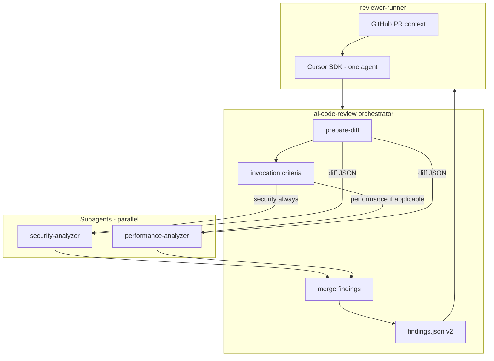

# Specialized analyzers (security + performance subagents)

**Status:** Pending

## Product summary

Evolve the AI code reviewer from a **single-step monolithic analysis** to an **orchestrator** that delegates to **specialized subagents** with narrow prompts and their own rules. Each subagent is a domain expert (security, performance); the orchestrator only coordinates: prepare the diff, decide which analyzers to run, launch them **in parallel**, read results via **JSON files**, and produce the final report consumed by `reviewer-runner`.

**Success in this phase:** after `prepare-diff`, at most two analyzers run (`security` always; `performance` only when the diff warrants it); findings merge into `.ai-code-review/findings.json` (**schema v2**) and the **runner** posts inline comments with enriched formatting (analyzer title + severity emojis). Incremental flow from spec 02 (tracking, scope, dedup) **must not break**.

## Scope

### In scope

| # | Area | Notes |
|---|------|--------|
| 1 | **Orchestrator role** (`ai-code-review` skill) | Coordinates diff → invocation criteria → subagents → merge → `findings.json`. Does **not** filter severity, dedupe findings, or run a separate validation step. |
| 2 | **Two analyzers** | `security` (always) and `performance` (conditional). **Parallel** execution when both apply. |
| 3 | **Subagent definitions** | `.cursor/agents/ai-code-review-{key}-analyzer.md` with frontmatter `name` aligned to Task `subagent_type`. |
| 4 | **Invocation criteria** | Skill reference doc (e.g. `references/invocation-criteria.md`) + deterministic logic evaluated by the orchestrator **after** `prepare-diff`. |
| 5 | **File ↔ agent contract** | Orchestrator **writes** diff input; each subagent **reads** input and **writes** output JSON; orchestrator **reads** outputs. Do **not** trust Task return text — only that the file exists and is valid JSON. |
| 6 | **Minimal Task prompts** | Analyzer invocation: **exactly two lines** (read path + write path). Intelligence lives in the subagent system prompt, not the Task prompt. |
| 7 | **Retries** | Missing output or invalid JSON: **1 retry** with the same two-line prompt; on second failure → treat as `{ "findings": [] }` for that analyzer. |
| 8 | **Merge** | Concatenate `findings[]` with no cross-analyzer dedup; each item keeps `analyzer`; **v2** schema. Cross-analyzer dedup → **validator** phase. |
| 9 | **Schema v2 + posting** | `reviewer-runner`: validate v2, `formatCommentBody` with analyzer title and severity emojis (see **Inline comment format**). |
| 10 | **GitHub integration** | Same endpoints; runner still launches **one** orchestrator agent; orchestrator spawns subagents via Task. |
| 11 | **Incremental compatibility** | `prepare-diff`, stdout summary, known-issues, and spec 02 rules unchanged in behavior. |
| 12 | **Tests** | Invocation criteria, merge, comment formatting, and schema v2 validation. |

### Out of scope (this phase — explicit)

| # | Topic |
|---|--------|
| 1 | **Batching** for large PRs (multiple `batch-{i}.json`); one diff artifact per run. |
| 2 | **Validator** (semantic dedup, category filtering, ticket context). |
| 3 | Additional analyzers: `logic`, `mongodb`, `ticket`, or others. |
| 4 | Runner tracking/dedup changes beyond spec 02. |
| 5 | `evals/` harness, precision/recall metrics. |
| 6 | GitLab / other hosts (target: **GitHub** + existing Actions). |
| 7 | Dynamic analyzer registration in `reviewer-runner` (CI package does not list analyzers; they live in skill + `.cursor/agents/`). |

## Behavior

### Architecture



### Responsibility split

| Layer | Responsibility |
|-------|----------------|
| **`reviewer-runner`** | Incremental scope, tracking, known-issues, invoke **one** agent with the skill, validate and publish `findings.json`. |
| **Orchestrator skill** | `prepare-diff`, stdout summary, invocation criteria, write diff input, parallel Tasks, read outputs, merge, write final file. |
| **Analyzer subagent** | Read diff JSON; analyze per `.md` rules; write output JSON; reply only `Done`. |

### Orchestrator flow

1. Run `prepare-diff` (as today) → JSON at `.ai-code-review/prepare-diff.json` (or agreed path).
2. Print **mandatory diff run summary** (spec 02).
3. **Write** analyzer input artifact (copy or stable reference of prepare-diff output; see API/files).
4. **Evaluate invocation criteria** on `files[].path` and `files[].diff` (single implicit “batch”).
5. Build `analyzers_to_run` ⊆ `{ security, performance }`.
6. **Launch in one parallel batch** one Task per key in `analyzers_to_run` (`subagent_type` = frontmatter `name`).
7. **Collect:** read each output; on failure after retry → `{ "findings": [] }`.
8. **Merge** → normalize to **schema v2** → **overwrite** `.ai-code-review/findings.json`.
9. Confirm the file exists before finishing.

Analyzers **skipped** by criteria: do **not** launch Task; merge treats them as `{ "findings": [] }`.

### Invocation criteria (v1 — `security` and `performance` only)

Evaluate **once** per run, inspecting only `files[].path` and `files[].diff` from `prepare-diff` JSON (no multi-file batching).

| Key | Include when |
|-----|----------------|
| **security** | **Always** — every run. |
| **performance** | **Any** of the conditions below matches at least one file in the diff. |

**performance — conditions**

1. **Path heuristics** — path contains segments such as: `packages/`, `/api/`, `server`, `worker`, `service`, `route`, `handler`, `packages/reviewer-runner`, `packages/ledger-lite`, or data layers (`model`, `repository`, `db`, `database`).
2. **React** — path ends with `.tsx` or `.jsx`.
3. **Diff or path content** (case-sensitive where noted): `mongoose`, `mongodb`, `MongoClient`, `prisma`, `.aggregate(`, `.find(`, `.findOne(`, `getCollection`, SQL literals `INSERT` / `SELECT`, React hooks `useEffect`, `useState`, `useMemo`, `useCallback`, `React.memo`.

If **no** performance condition matches → **skip** performance (no Task).

**Recommended log order** (informational only): `security` → `performance`.

**Log example:**

```text
Analyzers: security, performance
```

or

```text
Analyzers: security (skipped: performance)
```

### File-based communication

Paths under `.ai-code-review/` (repo root, gitignored) for local + CI portability:

| Role | Path (v1) |
|------|-----------|
| Diff input (orchestrator → analyzers) | `.ai-code-review/work/diff.json` |
| Security output | `.ai-code-review/work/security-findings.json` |
| Performance output | `.ai-code-review/work/performance-findings.json` |
| Final report (runner) | `.ai-code-review/findings.json` |

The orchestrator **materializes** `diff.json` from `prepare-diff` output (same shape: `metadata` + `files[]`).

### Minimal Task prompts (analyzers)

**Exactly two lines**, no role, no “analyze X”, no JSON schema in the prompt:

```text
Read diff from: .ai-code-review/work/diff.json
Write findings to: .ai-code-review/work/security-findings.json
```

(replace `security` with `performance` and the matching output path).

On completion, the subagent writes pretty-printed JSON to the output path and replies only `Done` (do not dump JSON in chat).

### Subagent — definition in `.cursor/agents/`

File: `.cursor/agents/ai-code-review-{key}-analyzer.md`

Minimum frontmatter:

```yaml
---
name: ai-code-review-{key}-analyzer
model: composer-2.5   # fixed for all analyzers (Q3)
description: <one line for picker / logs>
---
```

Body (pattern):

- **MANDATORY** block: first action = Read path from Task prompt; tools Read / Grep / Write only; Write **only** to the indicated output.
- Narrow role: `{key}` detection — do not overlap the other analyzer.
- Document input shape (`metadata` + `files[].diff`).
- **Focus areas**, categories or internal labels, exclusions (“what the other analyzer covers”).
- **Intermediate output** schema (below).
- Close: Write to path → `Done`.

#### Cross-analyzer exclusions (v1)

| Analyzer | Focus | Leave out (other analyzer covers) |
|----------|-------|-----------------------------------|
| **security** | Secrets, injection, authz/authn, XSS/CSRF, weak crypto, exposed PII | Micro-optimizations, N+1, React renders |
| **performance** | N+1, heavy queries, hot loops, re-renders, bundles, caching | Pure security vulnerabilities |

### JSON schemas

#### Intermediate analyzer output

```json
{
  "analyzer": "security",
  "findings": [
    {
      "severity": "major",
      "file": "path/from/repo/root.ts",
      "line": 42,
      "issue": "…",
      "suggestion": "…",
      "category": "XSS"
    }
  ]
}
```

| Field | Rules |
|-------|--------|
| `analyzer` (root) | `security` \| `performance` — must match the subagent. |
| `severity` | `critical` \| `major` \| `minor` \| `enhancement` (replaces v1 `info` / `warning` / `error`). |
| `issue` | Problem description (formerly `problem`). |
| `category` | Optional; not published on GitHub in this posting phase. |
| `line` | Required for inline comment. |

#### Final report (runner — schema v2)

```json
{
  "version": "2",
  "findings": [
    {
      "analyzer": "performance",
      "severity": "minor",
      "file": "path/from/repo/root.ts",
      "line": 42,
      "issue": "…",
      "suggestion": "…"
    }
  ]
}
```

| Field | Rules |
|-------|--------|
| `version` | `"2"` — breaking change from v1. |
| `analyzer` | **Required** on each finding: `security` \| `performance`. Merge copies from subagent output. |
| `severity` | One of the four v2 severities. |
| `issue` / `suggestion` | Non-empty strings. |

**Migration:** update skill, subagents, fixtures, and `packages/reviewer-runner` (`findings.ts`, `comments.ts`, tests). v1 is no longer accepted after this phase.

### Inline comment format (GitHub)

One inline comment per finding. Markdown body, **same visual structure** in all cases:

```markdown
🤖 **{Analyzer title}**

{severity_emoji} {issue}

💡 **Suggestion:** {suggestion}
```

| `analyzer` (JSON) | `{Analyzer title}` |
|-------------------|---------------------|
| `security` | `Security analyzer` |
| `performance` | `Performance analyzer` |

| `severity` | Emoji on **issue** line |
|------------|-------------------------|
| `critical` | 🚨 |
| `major` | ⚠️ |
| `minor` | 💡 |
| `enhancement` | ✨ |

The **Suggestion** line **always** uses `💡 **Suggestion:**` (regardless of severity).

**Example** (`performance`, `minor`):

```markdown
🤖 **Performance analyzer**

💡 `getPracticeAccountFeatures` loads accountFeatures even though only `practice.country` is used.

💡 **Suggestion:** Use a country-only projection or `context.practice.country` when present.
```

Implement in `formatCommentBody(finding)` (or equivalent) in `reviewer-runner`; subagents do **not** format GitHub Markdown — only v2 JSON.

### Subagent invocation

| Parameter | Rule |
|-----------|------|
| Tool | `Task` (Cursor IDE); in CI, equivalent SDK tool/event when the orchestrator delegates. |
| `subagent_type` | Same as frontmatter `name` (e.g. `ai-code-review-security-analyzer`). |
| `description` | Short title for logs/UI — does not replace the prompt. |
| `prompt` | Paths only (two lines). Duplicating `.md` instructions in the prompt is an **anti-pattern**. |
| Parallelism | Launch **all** selected analyzers in **one** parallel batch; wait before collect/merge. |

### Known issues

The runner still passes `known-issues.json` and applies `filterFindingsForPost` (spec 02). **Dedup in orchestrator/subagents is out of this phase** — handled later with the validation step.

### Local vs CI

| Environment | Orchestrator | Subagents |
|-------------|--------------|-----------|
| **Cursor local** (`/ai-code-review`) | Agent with skill | Task → `.cursor/agents/*.md` |
| **GitHub Actions** | One SDK agent with skill | Same pattern via agent tools (cloud/local per SDK) |

## API / events

### Files (stable contracts)

| Path | Producer | Consumer |
|------|----------|----------|
| `.ai-code-review/prepare-diff.json` | `prepare-diff.ts` | Orchestrator |
| `.ai-code-review/work/diff.json` | Orchestrator | Subagents |
| `.ai-code-review/work/{key}-findings.json` | Subagent `{key}` | Orchestrator |
| `.ai-code-review/findings.json` | Orchestrator | `reviewer-runner` |

### Testable module (recommended)

Deterministic logic extractable for tests (location TBD in `/plan`):

- `selectAnalyzers(files: { path: string; diff: string }[]): ("security" | "performance")[]`
- `mergeAnalyzerOutputs(outputs: AnalyzerOutput[]): FindingsReport`

### GitHub / runner

No new endpoints. Changes in `findings.ts` (schema v2), `comments.ts` (replaces previous format), and fixtures. `ai-code-review.yml` workflow triggers unchanged.

## Acceptance criteria

- [ ] `.cursor/agents/ai-code-review-security-analyzer.md` and `ai-code-review-performance-analyzer.md` exist with `name` aligned to Task.
- [ ] Skill documents orchestrator → subagents → merge flow and links `references/invocation-criteria.md`.
- [ ] **security** runs on every non-empty diff; **performance** only when heuristics match.
- [ ] Selected analyzers launch **in parallel** (one Task batch).
- [ ] Analyzer Task prompts are **two lines only** (read/write paths).
- [ ] On output/JSON failure: **one** retry; then `{ "findings": [] }` for that analyzer.
- [ ] Final report satisfies **schema v2** (`analyzer`, `issue`, four severity levels).
- [ ] Published comments follow 🤖 title + issue emoji + `💡 **Suggestion:**` template.
- [ ] Incremental flow (tracking, skip, full fallback) still passes existing `reviewer-runner` and `prepare-diff` tests.
- [ ] Unit tests cover invocation criteria (performance positive/negative) and merge.
- [ ] No multi-diff batching, validator, or `logic` / `mongodb` / `ticket` analyzers.

## Validation checklist

- [ ] Acceptance criteria above are met
- [ ] `npm test` passes (including new criteria + merge tests)
- [ ] Manual check on a test PR: log shows correct launched/skipped analyzers
- [ ] Subagents write only to the output path and reply `Done`
- [ ] Valid `findings.json` after merge with 0, 1, or 2 active analyzers
- [ ] No open questions block release (or explicitly deferred in Open questions)

## Open questions

| # | Question | Status | Answer / decision |
|---|----------|--------|-------------------|
| 1 | Filter known-issues in orchestrator/subagents? | Deferred | Out of analyzers v1; **validator** (later phase). Runner keeps `filterFindingsForPost`. |
| 2 | `analyzer` in final JSON + posting format? | Resolved | **Yes:** required `analyzer` per finding; **schema v2**; `issue` replaces `problem`; severities `critical`/`major`/`minor`/`enhancement`; runner formats comments with emojis (see posting section). |
| 3 | Subagent model? | Resolved | Fixed **`composer-2.5`** in each `ai-code-review-{key}-analyzer.md` frontmatter (no inherit, no per-analyzer fast variants). |
| 4 | Dedup on merge when two analyzers share `(file, line)`? | Deferred | **No** merge dedup in this phase; cross-analyzer dedup with **validator** (later). Duplicate findings may coexist in `findings.json` until then. |
| 5 | Closed `category` list per analyzer or free-form in v1? | Deferred | Document in each `.md`; does not block merge. |

## Changelog

| Date | Author | Change |
|------|--------|--------|
| 2026-05-30 | brainstorm | Initial draft: orchestrator + security/performance, invocation criteria; out of scope: batching, validator, extra analyzers |
| 2026-05-30 | Human | Q1 deferred: known-issues dedup in orchestrator/subagents → validator phase |
| 2026-05-30 | Human | Q2 resolved: schema v2, `issue`, severity emojis, enriched posting with `analyzer` |
| 2026-05-30 | Human | Q3 resolved: subagents use `model: composer-2.5` |
| 2026-05-30 | Human | Q4 deferred: cross-analyzer dedup → validator |
| 2026-05-30 | Human | Rewrote spec in English |
