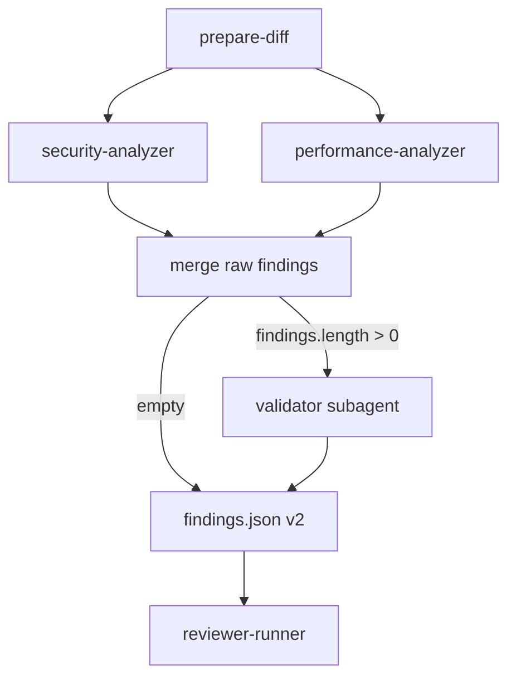

# Validator subagent (findings funnel)

**Status:** Pending

## Product summary

Add a **validator subagent** between raw analyzer merge and the final `findings.json` consumed by `reviewer-runner`. Analyzers **detect**; the validator **filters, deduplicates, verifies against the codebase, and calibrates severity** through a mandatory **five-phase** funnel.

**Success:** merged security/performance findings pass through the validator when non-empty; the orchestrator writes schema v2 `findings.json` only from validated output; `filter_summary` is persisted and logged for CI/debug; duplicate or low-confidence issues are reduced before GitHub inline posts. Incremental review, tracking, and `prepare-diff` behavior from specs 02–03 remain intact.

**Cleanup (same phase):** remove the optional `category` field from analyzer outputs, merge scripts, and agent definitions introduced in spec 03 — findings use only v2 fields (`analyzer`, `severity`, `file`, `line`, `issue`, `suggestion`).

## Scope

### In scope

| # | Area | Notes |
|---|------|--------|
| 1 | **Pipeline position** | After parallel analyzers + merge → **validator Task** → final `.ai-code-review/findings.json` (v2). |
| 2 | **Validator subagent** | `.cursor/agents/ai-code-review-validator.md` with frontmatter `name: ai-code-review-validator`, model `composer-2.5`, five-phase funnel, tool restrictions (Read, Grep, Write only to declared output). |
| 3 | **Reference docs** | `references/severity-guidelines.md`, `root-cause-dedup.md`, `false-positive-filters.md` (read in full at validator start). |
| 4 | **Orchestrator skill updates** | Write raw merged findings + known-issues path; invoke validator; read validator output; **abort** if output missing/invalid (no automatic retry). |
| 5 | **Early exit** | If merged raw findings count is **0**, skip validator; write `{ "version": "2", "findings": [] }`; write zeroed `filter_summary` to `work/validator-summary.json`. |
| 6 | **Five phases** | Exact dedup → root-cause cluster merge → false-positive filters → known-issues skip → deep codebase verification → severity calibration. |
| 7 | **Known issues** | Validator phase 3 consumes runner-built `.ai-code-review/known-issues.json` (`{ "issues": [{ "file", "line", "message" }] }` from GitHub inline comments). Runner **no longer** dedupes by `(file, line)` at post time — only drops findings outside PR file list. |
| 8 | **Remove `category`** | Strip from security/performance analyzer agents, examples, and `merge-findings` / intermediate types. |
| 9 | **Analyzer scope** | Inputs from `security` and `performance` only. Tie-break on dedup: **security > performance**. |
| 10 | **Observability** | `filter_summary` in validator output; orchestrator copies to `work/validator-summary.json` and logs one stdout line (e.g. `Validator funnel: 30 → 9`). |
| 11 | **CI failure** | Validator failure → orchestrator abort → **GitHub Actions job fails** (no unvalidated findings posted). |
| 12 | **Tests** | Orchestrator wiring, runner `filterFindingsForPost` (PR-files only), abort path, summary logging; remove category from existing tests if present. |

### Out of scope

| # | Topic |
|---|--------|
| 1 | `category` on findings (any layer). |
| 2 | Ticket cross-reference, `ticket.json`, ticket-analyzer. |
| 3 | `codebase-patterns.md` and repo-pattern skip step. |
| 4 | New analyzers (`logic`, `mongodb`, etc.). |
| 5 | Batching / multi-diff artifacts for large PRs. |
| 6 | Automatic retry of validator Task. |
| 7 | Git hosts other than **GitHub**. |
| 8 | `evals/` harness. |
| 9 | Workflow artifact upload for `filter_summary` (file + stdout only in v1). |

## Behavior

### Architecture (updated)



### Responsibility split

| Layer | Responsibility |
|-------|----------------|
| **Analyzers** | Detect issues in diff scope; write per-analyzer JSON (v2 fields only, no `category`). |
| **Orchestrator** | `prepare-diff`, parallel analyzer Tasks, merge to **raw** artifact, launch validator, map validated output → v2, fail closed on validator errors, log funnel summary. |
| **Validator** | Five-phase funnel; read three reference docs; write `validator-output.json`; reply `Done` only. |
| **reviewer-runner** | Incremental scope, tracking, build `known-issues.json`, invoke agent, validate v2, **`filterFindingsForPost` = PR file scope only**, post inline comments. |

### Validator agent definition

**Path:** `.cursor/agents/ai-code-review-validator.md`

**Frontmatter:**

| Field | Value |
|-------|--------|
| `name` | `ai-code-review-validator` (Task `subagent_type`) |
| `model` | `composer-2.5` |
| `description` | Validates, deduplicates, and calibrates raw analyzer findings through a 5-phase funnel. |

**MANDATORY constraints (in agent body):**

1. **First action:** Read **all** paths from the Task prompt and the three reference files before any chat output or JSON.
2. **Tools:** Read, Grep, Write — Write **only** to the output path from the prompt.
3. **No** Edit, Shell, or writes outside the declared output file.
4. **Phase order:** Phases 1–3 are cheap (reference docs only, no repo reads). Phase 4 = deep verification (Read/Grep, ~3–4 files max per surviving finding). Phase 5 = final severity calibration.

**Reference reads at start (always, full file):**

- `references/severity-guidelines.md`
- `references/root-cause-dedup.md`
- `references/false-positive-filters.md`

### Orchestrator workflow (skill changes)

1. Steps 1–8 unchanged: `prepare-diff` → analyzers (parallel) → collect outputs.
2. **Merge raw** to `.ai-code-review/work/raw-findings.json` — concatenated findings with `analyzer` on each item (v2 shape, no `category`).
3. If `raw_findings.length === 0`: write empty v2 `findings.json`; write zeroed `filter_summary` to `work/validator-summary.json`; **do not** launch validator.
4. Else ensure `known-issues.json` is available (runner path from prompt).
5. **Validator Task** — prompt is **data-only** (exactly three lines):

   ```text
   Read findings from: .ai-code-review/work/raw-findings.json
   Read known issues from: .ai-code-review/known-issues.json
   Write output to: .ai-code-review/work/validator-output.json
   ```

6. **Collect validator output** from file only. If missing or invalid JSON → **abort** (no unvalidated `findings.json`). **No** retry.
7. Map `validator-output.json` → `.ai-code-review/findings.json` (v2).
8. Copy `filter_summary` to `.ai-code-review/work/validator-summary.json`.
9. Print **one stdout line**: `Validator funnel: <raw_input> → <final_output>` (from `filter_summary`).

### Five-phase funnel (validator)

#### Phase 1 — Deduplicate (cheap)

**Step 1 — Exact dedup:**

- Same `file` + `line` → duplicate; keep higher severity; tie → more specific `issue`.
- Same `file`, lines within **≤3**, and substantially the same `issue` (same defect) → one finding; keep more precise line.
- Counter: `after_exact_dedup`.

**Step 2 — Root-cause cluster merge** (see `root-cause-dedup.md`):

- Cluster: same `file`, `|line_a - line_b| ≤ 3`, same root-cause key (derived from `issue` + `analyzer`, not a category field).
- Per cluster: higher severity → more specific `issue` → analyzer priority (**security > performance**).
- Do **not** merge unrelated defects (different symbols/APIs on the same line).
- Counters: `after_root_cause_dedup`; `after_dedup` = same value.
- `raw_input` = count before Step 1.

**Root-cause keys (document in reference):** e.g. `auth_bypass`, `injection`, `xss_unsanitized_html`, `event_loop_blocking`, `fire_and_forget_async`, `read_modify_write_race`, `n_plus_one`, `secret_exposure`, `missing_authz` — inferred from issue text and analyzer, not from a `category` column.

#### Phase 2 — False-positive filters (cheap)

Apply `false-positive-filters.md` plus inline rules in the agent, including (non-exhaustive):

| Pattern | Action |
|---------|--------|
| Hook/i18n false positives at module level | Skip |
| Null check on TS non-nullable param | Skip |
| Missing import with no imports in diff | Skip |
| Method signature not visible in diff | Skip |
| Required-field null check on domain model | Downgrade or skip |
| “Library API missing” without version in diff | Downgrade one level |
| Playwright `Promise.all` + navigation waits in e2e | Skip race/promise-style issues |
| Test files (`*.test.ts`, `*.spec.ts`, `__tests__/`) | Downgrade one level |
| Placeholder credentials (`YOUR_API_KEY`, `example.com`, etc.) | Skip |
| Static `data-testid` without interpolation | Skip PII-style exposure |

Counter: `after_fp_filters`.

#### Phase 3 — Skip known issues (cheap)

For each finding vs `known_issues.issues[]`:

- Same `file` + `line` → skip.
- Same `file`, similar `issue` text to `message`, line ±2 → skip.

Counter: `after_known_issues`.

#### Phase 4 — Deep verification (expensive, mandatory for survivors)

Each finding that passed 1–3 must be traced in the codebase (Read/Grep, ~3–4 files max per finding).

Use **`issue` text + `analyzer`** to choose verification strategy (documented in agent / `false-positive-filters.md`), e.g.:

| Signal in `issue` / analyzer | Verification |
|------------------------------|--------------|
| Input / validation | Trace input origin; drop if validated upstream |
| Auth / access (security) | Middleware/guards; drop if auth enforced upstream |
| Error handling | try/catch/callers; drop if handled above |
| Null / undefined | Types/guards upstream; drop if null impossible |
| PII / exposure (security) | Sanitization in flow; drop if masked or internal sink |
| Performance (N+1, blocking, etc.) | Confirm hot path / caller; drop if mitigated |

**Default** for all other findings:

1. Understand the claim in `issue`.
2. Trace value/stack/state in related files.
3. Grep + Read definitions.
4. Mitigation anywhere in trace → **DROP**; confirmed → **KEEP**; inconclusive: minor/enhancement → DROP; major/critical → KEEP but downgrade one level.

Counter: `after_verification`.

#### Phase 5 — Severity calibration (final)

Per `severity-guidelines.md`:

1. Speculative language (“could”, “might”, “possibly”) → `enhancement`.
2. `critical` only with confirmed high-impact evidence.
3. Between two levels → choose the **lower**.
4. Test-only findings: cap at `major` (never `critical` on tests alone).
5. Suggested null check on non-nullable type → `enhancement` or skip.

**Emoji** (informational in validator output; runner uses same mapping in `comments.ts`):

| Severity | Emoji |
|----------|-------|
| critical | 🚨 |
| major | ⚠️ |
| minor | 💡 |
| enhancement | ✨ |

Counter: `final_output`.

### Validator output JSON

**Path:** `.ai-code-review/work/validator-output.json` (pretty, 2-space indent).

```json
{
  "findings": [
    {
      "file": "relative/path.ts",
      "line": 42,
      "severity": "major",
      "analyzer": "security",
      "issue": "...",
      "suggestion": "...",
      "emoji": "⚠️"
    }
  ],
  "filter_summary": {
    "raw_input": 30,
    "after_exact_dedup": 25,
    "after_root_cause_dedup": 22,
    "after_dedup": 22,
    "after_fp_filters": 15,
    "after_known_issues": 13,
    "after_verification": 9,
    "final_output": 9
  }
}
```

| Rule | Detail |
|------|--------|
| `filter_summary` | **Required**; no `after_ticket_crossref` key. |
| `analyzer` | Preserve from input; do not infer. |
| `issue` / `suggestion` | Non-empty; map 1:1 to v2. |
| `emoji` | Aligns with severity table (runner recomputes from severity for posts). |
| Chat | Reply exactly `Done` after Write. |

Orchestrator copies `filter_summary` to `work/validator-summary.json` and logs `Validator funnel: <raw_input> → <final_output>`.

### Severity definitions

Documented in `references/severity-guidelines.md` (summary):

- **critical:** Confirmed high impact; traceable path; no speculation.
- **major:** Clear failure mechanism, plausible in prod.
- **minor:** Real issue, bounded impact.
- **enhancement:** Nice-to-have, not a defect.

### Integration with `reviewer-runner`

| Concern | Behavior |
|---------|----------|
| **Invocation** | One orchestrator agent; orchestrator spawns validator via Task when raw findings non-empty. |
| **Known issues** | Runner still builds `known-issues.json` for the validator prompt. **`filterFindingsForPost`:** drop findings whose `file` ∉ PR file set only — **do not** filter by `(file, line)` vs known issues. |
| **validate v2** | Unchanged; no `category` on `Finding`. |
| **Comment format** | Unchanged (`formatCommentBody`). |
| **Validator failure** | Orchestrator aborts → runner/Actions **fail the job**; no inline posts from raw merge. |

### File contract (`.ai-code-review/`)

| Path | Role |
|------|------|
| `work/raw-findings.json` | Merged analyzer findings pre-validation |
| `work/validator-output.json` | Validator subagent output |
| `work/validator-summary.json` | Copy of `filter_summary` for logs/CI |
| `findings.json` | Final v2 post-validator |
| `known-issues.json` | Runner-built; input to validator only |

## API / events

N/A for HTTP.

| Producer | Consumer | Artifact |
|----------|----------|----------|
| Orchestrator | Validator | `work/raw-findings.json`, `known-issues.json` |
| Validator | Orchestrator | `work/validator-output.json` |
| Orchestrator | reviewer-runner | `findings.json` v2, `work/validator-summary.json` |

## Acceptance criteria

- [ ] `.cursor/agents/ai-code-review-validator.md` exists with five phases, tool restrictions, three reference docs.
- [ ] Reference docs: `severity-guidelines.md`, `root-cause-dedup.md`, `false-positive-filters.md` (no `codebase-patterns.md`).
- [ ] `category` removed from security/performance analyzer agents and from merge/intermediate types.
- [ ] Orchestrator runs validator after merge, before `findings.json`; skips validator when raw is empty.
- [ ] Validator Task prompt is exactly three data lines (findings, known issues, output path).
- [ ] Invalid/missing validator output → abort; CI job fails; no unvalidated findings posted.
- [ ] `filter_summary` present without `after_ticket_crossref`; copied to `validator-summary.json`; stdout funnel line logged.
- [ ] Validated output maps to schema v2 (no extra fields required on `Finding`).
- [ ] Cross-analyzer dedup at same `(file, line)` in validator phase 1, not in merge script.
- [ ] `filterFindingsForPost` only removes findings outside PR file list (tests updated).
- [ ] Spec 02 incremental flow still passes existing tests.

## Validation checklist

- [ ] Acceptance criteria above are met
- [ ] `npm test` passes in `packages/reviewer-runner`
- [ ] Local dry-run: non-empty raw → validator → v2; empty raw → no validator Task
- [ ] Actions log contains `Validator funnel: N → M`
- [ ] Severity emojis align with `packages/reviewer-runner/src/comments.ts`
- [ ] No `category` in analyzer JSON samples or merge output

## Open questions

| # | Question | Status | Answer / decision |
|---|----------|--------|-------------------|
| 1 | Optional `category` on v2 / analyzer outputs? | Resolved | **Remove entirely** — this phase and retroactive cleanup in spec 03 artifacts. |
| 2 | Runner `filterFindingsForPost` after validator? | Resolved | **PR file scope only**; known-issues dedup owned by validator phase 3. |
| 3 | Ticket cross-ref? | Resolved | **Out of scope** — no phase, no `ticket.json`, no counter. |
| 4 | Category normalization? | Resolved | N/A — categories removed. |
| 5 | `codebase-patterns.md`? | Resolved | **Out of scope** — no file, no step. |
| 6 | Validator abort in CI? | Resolved | **Fail the Actions job** (option A). |
| 7 | `filter_summary` observability? | Resolved | **`validator-summary.json` + stdout line** (option B); no workflow artifact in v1. |

## Changelog

| Date | Author | Change |
|------|--------|--------|
| 2026-05-30 | brainstorm | Initial draft |
| 2026-05-30 | Human | Resolved all open questions: 5-phase funnel; no category/ticket/codebase-patterns; runner PR-only filter; CI fail on validator error; validator-summary + stdout |
