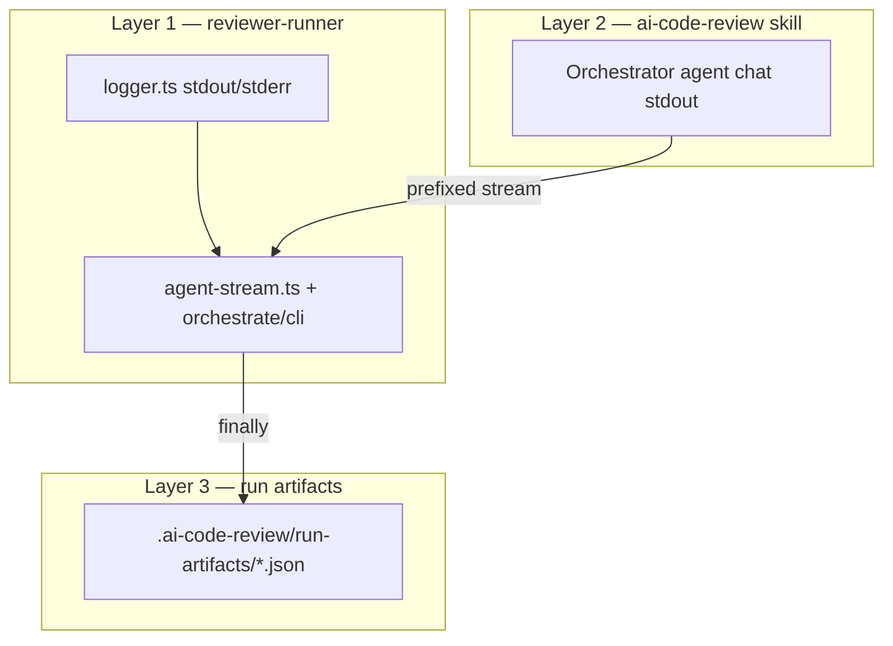

# Pipeline observability (pre-analyzer + end-to-end)

## Product summary

Operators and contributors need to **see what the AI review pipeline is doing** in GitHub Actions and in local runs—before parallel analyzers start, while subagents run, and when findings are posted—without reading raw JSON or full agent transcripts.

Success means **three complementary visibility layers**: a structured **Node wrapper** (`reviewer-runner`) on stdout/stderr with **ANSI color and bold** (readable in GitHub Actions and local terminal), **prescribed orchestrator output** from the `ai-code-review` skill (streamed with a fixed prefix), and **optional run artifacts** for post-mortem debugging. Pipeline stdout must look **polished**—curated phases and emoji blocks only, **not** a dump of SDK tool/task events. Human-facing logs stay **counts and summaries**; findings and prompts live in files under `.ai-code-review/`.

This work **does not change** analyzer logic, invocation criteria, validator funnel rules, or GitHub posting semantics from specs 02–04. It makes existing behavior **legible and consistent**.

## Scope

### In scope

| # | Area | Deliverable |
|---|------|-------------|
| 1 | **Wrapper logger** | `packages/reviewer-runner/src/logger.ts`: ANSI helpers with a **fixed palette** (see Visual design); bold where specified; `NO_COLOR` / non-TTY → plain text without escape codes. CI sets `FORCE_COLOR=1` when appropriate so Actions logs stay colored. |
| 2 | **Pre-agent wrapper logs** | Ordered banner: run title, PR/repo metadata (from `GITHUB_*` / CLI), incremental vs full, skip reasons, known-issues count, paths for `pr-files.txt` / `known-issues.json`, prompt preview box (char count + known-issue count), then “Launching Cursor agent…”. |
| 3 | **SDK stream (wrapper)** | Refactor `agent-stream.ts`: forward **orchestrator assistant text only** (prescribed blocks + machine lines); prefix `[orchestrator]`; strip markdown; emit **styled** `subAgentLaunched` / `subAgentDone` from Task lifecycle internally—**never** raw `tool_call` / `tool_use` / `task` / `system` / `status` lines on stdout. |
| 4 | **Post-agent wrapper logs** | After agent: findings count, PR-scope filter drop count (if any), inline post plan, per-comment skip/post lines (structured, not ad-hoc `console.log`), tracking create/update, **Review Summary** table, final `done`. Early exit (incremental skip): warn + summary with `0 (skipped…)` + done. |
| 5 | **Orchestrator skill — progress** | `SKILL.md` section **Progress visibility**: minimal chat; reason with tools; optional **TodoWrite** checklist (`prereq`, `metadata`, `diff`, `analyzers`, `collect`, `validate`, `report`) status-only updates. |
| 6 | **Orchestrator skill — emoji blocks** | Fixed templates for metadata, diff stats (+ incremental/full), analyzer selection per run, collect, validator skip/complete; **mandatory consolidated block** before finish repeating prior blocks in order + severity counts (`🎯 Review complete: …`). |
| 7 | **Orchestrator final line** | Exactly one closing stdout line: `Report written to: .ai-code-review/findings.json` (repo-relative path used in this project)—no extra tables, timestamps, or duplicate summaries on that line. |
| 8 | **Preserve existing machine lines** | Keep `Analyzers: …` and `Validator funnel: raw → final` lines (spec 03–04); consolidated emoji block is additive for humans, not a replacement for funnel metrics. |
| 9 | **Run artifacts (optional v1)** | On agent run completion (success or failure), write `.ai-code-review/run-artifacts/`: `manifest.json`, `orchestrator.json` (prompt + conversation), `subagents/{slug}-{callId8}.json` per Task subagent. |
| 10 | **CI artifact upload** | GitHub Actions: `upload-artifact@v4` artifact name `ai-review-run-artifacts`, path `.ai-code-review/run-artifacts/**`, default retention (7 days). |
| 11 | **Tests** | Unit tests for logger (TTY off, color on with `FORCE_COLOR`), stream prefix/strip helpers, subagent line formatting; assert SDK noise events produce **no** stdout; snapshot golden strings for styled wrapper lines. |
| 12 | **CI color** | Workflow env `FORCE_COLOR=1` (and logger respects it when `CI=true`) so wrapper ANSI renders in Actions log viewer. |

### Out of scope

| Item | Notes |
|------|--------|
| Multi-batch diff / `batch-{i}.json` | Remains deferred (spec 03). |
| Ticket / JIRA context blocks | Not in this repo. |
| Logging full findings JSON or `filter_summary` detail in emoji blocks | Counts + existing `Validator funnel:` line only. |
| Subagent reasoning in stdout | Subagents still write JSON under `.ai-code-review/work/` and reply `Done`. |
| `prepare-diff` stderr in skill chat | Keep script stderr suppressed in skill invocations; warnings surface via `metadata.warnings` and orchestrator blocks. |
| Shell one-liners to write report in chat | Security: no env-leaking shell in skill. |
| Agent timeout/cancel | No timeout API in runner today; defer unless SDK hook lands in same phase. |
| Replacing `.agents/skills/read-gh-ai-reviewer-logs` | May follow up if step names change; not required for v1. |
| Bitbucket or non-GitHub hosts | GitHub Actions + local `npm run review` only. |
| Raw SDK stream on stdout | No `[agent] tool_call`, `tool_use`, `task`, `system`, `status`, `thinking` (CI), or call_id dumps—debug detail lives in `run-artifacts/` only. |

## Behavior

### Three layers (conceptual)

Subagents **do not** emit pipeline logs. The wrapper may **derive** human sub-agent lifecycle lines from Task events internally but must **not** print SDK event names, call IDs, or generic tool lines. Analyzer/validator detail is recovered from work JSON files and optional Layer 3 captures.

### Typical CI log order

1. Wrapper: header → meta (PR, branch, SHAs) → incremental/skip/known-issues steps.
2. Wrapper: prompt box → “Launching Cursor agent…” → run id.
3. Wrapper: `› [sub-agent] Launched: …` (× N).
4. Stream: `[orchestrator]` lines (metadata/diff blocks may appear early).
5. Wrapper: `✔ [sub-agent] Completed (Xs): …`.
6. Stream: consolidated emoji block (Step 7 in skill) + `Report written to: …`.
7. Wrapper: agent completed → post/tracking lines → Review Summary → done.

### Visual design (ANSI — required when color enabled)

Pipeline logs must read as a **designed CLI experience**, not debug spew. When color is on (`stdout` is a TTY **or** `FORCE_COLOR` / `CI` with `FORCE_COLOR=1`, and `NO_COLOR` unset):

| Element | ANSI | Glyph / style |
|---------|------|----------------|
| `header(title)` | **bold cyan** | Horizontal rule or banner line + title |
| `section(title)` | **cyan** | Centered or padded separator with title |
| `meta(label, value)` | label **dim**, value **white** | `  label    value` |
| `step(msg)` | **cyan** | `› msg` |
| `ok(msg)` | **green** | `✔ msg` |
| `warn(msg)` | **yellow** on **stderr** | `⚠ msg` |
| `error(msg)` | **red** on **stderr** | `✗ msg` |
| `done(msg)` | **bold green** | Final success line |
| `prompt(text, meta)` | **cyan** box border; meta line **dim** | Full prompt body inside box; meta: `N chars · M known issue(s)` |
| `summary(...)` | **bold** title `Review Summary`; labels **dim**, values **white** | Aligned columns or fixed-width table |
| `subAgentLaunched(desc)` | **cyan**, indented | `  › [sub-agent] Launched: {desc}` |
| `subAgentDone(state, sec, desc)` | **green** ✔ or **red** ✗, indented | `  ✔ [sub-agent] Completed (12.3s): {desc}` |
| `[orchestrator]` prefix | **dim cyan** | Every forwarded orchestrator line |

**Bold** is used for titles, `done`, and summary headers—not for every line. Do not rely on markdown in stdout (GitHub Actions does not render `**`); use ANSI bold instead in the wrapper.

Plain mode (`NO_COLOR` or non-TTY without `FORCE_COLOR`): same glyphs (`✔`, `⚠`, `›`) without escape codes.

### Layer 1 — `reviewer-runner`

**Module:** `packages/reviewer-runner/src/logger.ts`  
**Consumers:** `cli.ts`, `orchestrate-review.ts`, `agent.ts`, `github.ts` (tracking), post-comment path, `agent-stream.ts`.

| API | Semantics |
|-----|-----------|
| `header(title)` | See Visual design. |
| `meta(label, value)` | See Visual design. |
| `step(msg)` | See Visual design. |
| `ok` / `warn` / `error` | See Visual design. |
| `section(title)` | See Visual design. |
| `done(msg)` | See Visual design. |
| `prompt(text, meta)` | See Visual design; full prompt body, no truncation. |
| `summary(fields)` | See Visual design. |
| `subAgentLaunched(description)` | See Visual design; human description only (no call_id). |
| `subAgentDone(state, elapsedSec, description)` | See Visual design. |

**Migrate** all wrapper `console.log` / `[review]` / `[agent]` ad-hoc output to `logger.*`. Remove legacy `[agent] tool_call` / `tool_use` / `task` logging entirely.

**Stream rules (`agent-stream.ts`) — quiet SDK, loud humans:**

| SDK event | Stdout behavior |
|-----------|-----------------|
| `assistant` → `text` | Forward each line with `[orchestrator] ` prefix; strip `**` and fenced code markers from text. |
| `assistant` → `tool_use` | **Ignore** (do not log tool name or args). |
| `tool_call` (Task / sub-agent) | **Do not** log raw event. Update internal state; on start → `subAgentLaunched`; on terminal status → `subAgentDone`. |
| `tool_call` (non-Task) | **Ignore** unless required later—default **ignore**. |
| `task` | **Ignore** |
| `system` | **Ignore** on stdout (capture in `orchestrator.json` artifact only). |
| `status` | **Ignore** |
| `thinking` | **Ignore** in CI; local TTY optional per Q3—default **ignore** everywhere for a cleaner pipeline (artifact has full trace). |

**Rationale:** Operators want a **beautiful timeline** (wrapper phases → orchestrator blocks → sub-agent lifecycle → summary), not a transcript of every Cursor tool invocation. Tool/task detail belongs in Layer 3 artifacts.

**Fatal errors:** git resolution failure → `error` + exit 1; agent failure → `error`/`warn` + non-zero exit; missing `.ai-code-review/findings.json` after successful agent status → error referencing `[orchestrator]` logs and artifact directory.

### Layer 2 — `ai-code-review` skill

**Who writes:** the orchestrator Cursor agent executing the skill (not Node directly).  
**Who reads:** humans via prefixed stream; wrapper does not parse emoji blocks.

**Content rules:**

- No long “Let me…” monologues; prescribed lines + tool work **in silence** (tools are not narrated to stdout).
- **Do not** print Task prompts, tool names, `tool_use` blocks, or step-by-step “I will run prepare-diff…” prose to chat—only the fixed emoji/plain machine lines below.
- Each pipeline step **records data** used in the final consolidated block.
- Ad-hoc warnings (main/master, detached HEAD, analyzer retry, invalid incremental SHA) may print immediately with `Warning:` or `⚠️` and are **repeated** in the consolidated block where applicable.

**Emoji block templates (fixed strings; values from `prepare-diff` metadata / work files):**

| Step | Block |
|------|--------|
| Metadata | `📋 PR Metadata:` — source/target branch, incremental yes/no + since SHA |
| Diff | `📊 Diff stats:` — file count, +/- lines, excluded count; full vs incremental label |
| Analyzers | `🔬 Analyzers:` — selected list and `(skipped: …)` |
| Collect | `📥 Collected results:` — raw count, categories derived from analyzers present |
| Validator | `⏭️ Validator skipped: …` **or** `✅ Validator complete: {raw} raw → {final} validated` |
| Close | Repeat 📋 📊 🔬 📥 ✅ in order, then `🎯 Review complete:` severity breakdown — counts from **final** `.ai-code-review/findings.json` (post-validator), not raw merge |

**Diff visibility (spec 03 superseded for stdout):** only the 📊 block (+ immediate `Warning:` / `⚠️` for `metadata.warnings` and incremental fallback). Plain-text “Mandatory diff run summary” is **removed** from the skill. Machine lines `Analyzers:` / `Validator funnel:` remain plain.

**Final stdout line (strict):** only  
`Report written to: .ai-code-review/findings.json`  
—or embedded JSON report block **only** when file write is impossible (local edge case documented in skill).

### Layer 3 — run artifacts

**Directory:** `.ai-code-review/run-artifacts/` (gitignored via `.ai-code-review/`).

| File | Contents |
|------|----------|
| `manifest.json` | `run_id`, model id, timestamps, subagent list |
| `orchestrator.json` | Prompt + full conversation from SDK run |
| `subagents/{slug}-{callId8}.json` | Per-Task prompt, status, duration, result text |

Written in a `finally` path after agent stream ends (success or failure). Does **not** replace Layer 1/2 for routine CI triage.

### Layer 4 — GitHub post (wrapper, no emoji)

Use logger `step`/`warn`/`ok` for:

- Skip: missing file/line, out-of-scope file, duplicate comment.
- Posted inline on `path:line` (comment id when API returns it).
- Totals: `Posted N inline comment(s) out of M issue(s)`.
- Tracking: created/updated tracking comment id + commit SHA.

### What must NOT appear on stdout

- Full `findings.json` or per-finding bodies.
- Validator `filter_summary` JSON (only funnel line + optional validated counts in ✅ block).
- Subagent output file contents.
- Secrets in stdout: the runner prompt must not embed tokens; `log.prompt` prints the full prompt as built (for debugging). Redact in `buildReviewPrompt` if a secret could appear in text.
- **Any raw SDK instrumentation**, including but not limited to: `[agent] tool_call`, `[agent] tool_use`, `[agent] task`, `[agent] system`, `[agent] status`, `call_id=`, tool argument JSON, Bash/shell command echoes from the orchestrator stream, and TodoWrite progress text (IDE-only; not stdout).
- Markdown bold/fences in orchestrator lines (strip on forward; wrapper uses ANSI bold instead).

## API / events

| Surface | Contract |
|---------|----------|
| **CLI** | No new flags required; `NO_COLOR` disables ANSI; `FORCE_COLOR=1` forces ANSI (including in CI). |
| **Env (CI)** | Existing `GITHUB_*`, `CURSOR_API_KEY`; workflow sets `FORCE_COLOR=1`; logger reads PR metadata from `GITHUB_EVENT_PATH` when present. |
| **SDK** | `Agent.create` → `send` → `stream` → `wait`; stream handler is the integration point for Layer 1 + 3. |
| **Skill stdout** | Prescribed blocks + machine lines + single final path line (Layer 2). |
| **Artifacts** | Filesystem only; CI `actions/upload-artifact` path `.ai-code-review/run-artifacts/`. |

## Acceptance criteria

- [ ] `logger.ts` implements the Visual design palette (cyan/green/yellow/red/dim/bold) and disables escape codes when `NO_COLOR` is set; honors `FORCE_COLOR=1` in CI without a TTY.
- [ ] A CI run log shows **colored** wrapper lines (header, ok/warn, done, summary) when viewed in GitHub Actions (workflow sets `FORCE_COLOR=1`).
- [ ] A full CI/local run prints wrapper header/meta before the agent starts, including incremental vs full and known-issues count.
- [ ] `log.prompt` prints the **complete** orchestrator prompt (plus char/known-issue meta) before agent launch.
- [ ] Orchestrator assistant text in logs is always line-prefixed with `[orchestrator]`; markdown bold/fences are stripped from streamed lines.
- [ ] Each analyzer/validator Task shows **styled** `subAgentLaunched` / `subAgentDone` lines only—no raw `tool_call` / `task` / `tool_use` lines anywhere in stdout.
- [ ] Streaming the agent emits **zero** lines matching `[agent] tool_call`, `[agent] tool_use`, or `[agent] task` (regression guard).
- [ ] After the agent, wrapper prints findings count, inline post summary, tracking update, and a Review Summary table before exit 0.
- [ ] Incremental skip (no agent) still prints warn + summary with zero findings and exits 0 without invoking the agent.
- [ ] Skill documents emoji blocks, TodoWrite checklist, consolidated final block, and strict final path line; orchestrator run in CI produces the consolidated block on stdout before wrapper post-agent lines.
- [ ] Machine lines `Analyzers: …` and `Validator funnel: …` still appear when analyzers/validator run (regression guard).
- [ ] Agent failure leaves tracking comment unchanged and exits non-zero with `error`/`warn` guidance.
- [ ] Missing `.ai-code-review/findings.json` after a “successful” agent wait fails with an error that points operators to `[orchestrator]` logs and `run-artifacts/`.
- [ ] When the agent runs, `run-artifacts/manifest.json` and `orchestrator.json` exist; subagent files exist for each Task subagent invoked.
- [ ] GitHub Actions workflow uploads `run-artifacts` artifact on runs where the directory exists.
- [ ] Unit tests cover logger plain mode and stream line prefix/strip helpers.

## Validation checklist

- [ ] Acceptance criteria above are met
- [ ] `npm test` passes in `packages/reviewer-runner`
- [ ] Manual: `npm run review -w reviewer-runner -- --dry-run` shows new wrapper phases without requiring API key where skip applies
- [ ] Manual: local run with `CURSOR_API_KEY` shows `[orchestrator]` blocks and final path line in terminal
- [ ] Manual: inspect uploaded Actions artifact `run-artifacts` after a PR sync run
- [ ] No open questions block release (or explicitly deferred in Open questions)
- [ ] Spec index in `.agents/AGENTS.md` updated; no reference to external/private systems in repo docs

## Open questions

| # | Question | Status | Answer / decision |
|---|----------|--------|-------------------|
| 1 | Keep plain-text **Mandatory diff run summary** alongside emoji 📊 or replace entirely? | Resolved | **B** — 📊 only; drop plain mandatory diff block; keep `Analyzers:` / `Validator funnel:` plain. |
| 2 | Artifact retention days / name in `ai-code-review.yml`? | Resolved | **A** — artifact name `ai-review-run-artifacts`; `upload-artifact@v4` default retention (7 days). |
| 3 | Include `thinking` stream previews in CI logs or suppress as noise? | Resolved | **B** (original); **superseded by visual polish** — no `thinking` on stdout; full trace in `run-artifacts/orchestrator.json` only. |
| 4 | Prompt box: max preview lines/chars before truncation? | Resolved | **Full prompt** in `log.prompt` (CI + local); meta line retained; runner must not place secrets in prompt text. |
| 5 | Should `read-gh-ai-reviewer-logs` filter script gain optional “orchestrator-only” mode? | Deferred | Out of v1 unless log volume forces it |
| 6 | Map severity counts in 🎯 from `findings.json` or from `validator-summary.json`? | Resolved | **A** — count severities from final `findings.json` (what the runner posts). |

_Status: `Open` · `Deferred` · `Resolved`_

## Changelog

| Date | Author | Change |
|------|--------|--------|
| 2026-05-30 | brainstorm | Initial draft: three-layer observability, wrapper logger + stream + skill blocks + run artifacts |
| 2026-05-30 | Human | Q1 resolved: diff stdout = 📊 block only (B) |
| 2026-05-30 | Human | Q2 resolved: artifact `ai-review-run-artifacts`, 7d default (A) |
| 2026-05-30 | Human | Q3 resolved: `thinking` logs local TTY only (B) |
| 2026-05-30 | Human | Q4 resolved: full orchestrator prompt in `log.prompt` (no truncation) |
| 2026-05-30 | Human | Q6 resolved: 🎯 severity counts from final `findings.json` (A) |
| 2026-05-30 | Human | Require ANSI visual design; suppress all raw SDK tool/task/system/status stdout |
