# Evals harness (golden cases + regression)

**Status:** Pending

## Product summary

Introduce an **`evals/`** regression harness for the AI code review pipeline so prompt, subagent, and orchestrator changes can be validated **before** they reach CI on real PRs.

**Success (v1):** Three eval suites run against the same contracts as production — **E2E** (full orchestrator path), **analyzer** (security + performance in isolation), and **validator** (in isolation) — each backed by **golden cases** (fixture workspace + expected outcomes). A developer can run evals locally or in a dedicated CI job with `CURSOR_API_KEY`, see pass/fail per case, and optional aggregate metrics (recall-style for expected findings).

Deterministic pipeline code (`prepare-diff`, `merge-findings`, `validator-output`, `select-analyzers`) **stays in Vitest** (colocated `*.test.ts` or future root runner); **`evals/` is only for runs that invoke models**.

## Scope

### In scope

| # | Area | Notes |
|---|------|--------|
| 1 | **`evals/` layout** | Top-level folder: `cases/`, shared `lib/` (runner, workspace seeding, assertions), optional `config` for model id and thresholds. |
| 2 | **Golden case format** | Per case: fixture repo snapshot (or git worktree), inputs under `.ai-code-review/work/` where needed, `expect.json` (must-find / must-not-find / optional funnel expectations). |
| 3 | **E2E evals** | Same entry as CI (`runReviewAgent` + `buildReviewPrompt`) on the monorepo with **pinned `base_sha` and `head_sha`** (never floating `main`), frozen `pr-files.txt` scoped to `packages/ledger-lite/`, and `known-issues.json`. Assert final `findings.json` (schema + judge). |
| 4 | **Analyzer evals** | Run **one** analyzer subagent per case with **identical** invocation contract as the orchestrator skill (see Invocation parity). Input: pre-seeded `work/diff.json` from `prepare-diff` output shape. Output: `work/{security\|performance}-findings.json`. |
| 5 | **Validator evals** | Run validator subagent with **identical** three-line Task prompt and reference-doc reads as production. Input: pre-seeded `work/raw-findings.json` + `known-issues.json`. Output: `work/validator-output.json` → map via `validator-output.ts` for assertions. |
| 6 | **Invocation parity module** | Single source of truth for Task prompts, `subagent_type` names, model id (`composer-2.5`), `settingSources: ["project"]`, and relative paths under repo root — consumed by eval runner and documented as matching `SKILL.md` / `.cursor/agents/*.md`. |
| 7 | **Assertions** | Structural gates (valid JSON, schema v2) are deterministic; **pass/fail on expectations** uses **LLM-as-judge always** in v1 (`judge.rubric` per `must_find` / `must_not_find`). Optional numeric checks on `filter_summary` where applicable (validator cases). |
| 8 | **CLI / npm script** | e.g. `npm run eval` (or `eval:e2e`, `eval:analyzers`, `eval:validator`) from repo root; requires `CURSOR_API_KEY`; clear skip message when missing. |
| 9 | **Starter golden set** | Minimum: **2** E2E, **≥1** security analyzer, **≥1** performance analyzer, **≥2** validator (positive + filter/negative); component cases use `evals/fixtures/` + frozen inputs; E2E uses pinned SHAs + ledger-lite scope. |
| 10 | **Local-only execution (v1)** | `npm run eval` documented for local dev; **no** GitHub Actions workflow in v1. Revisit CI (manual/nightly) in a later spec if needed. |

### Out of scope (v1)

| # | Topic |
|---|--------|
| 1 | Moving existing Vitest files from `.cursor/skills/.../scripts/*.test.ts` into `evals/`. |
| 2 | Precision/recall dashboards, feedback loop from production PR comments. |
| 3 | Evals for `reviewer-runner` GitHub API, tracking comment, or inline post formatting. |
| 4 | Multi-model matrix or temperature sweeps. |
| 5 | Automatic retry of validator (matches production). |
| 6 | Multiple performance analyzer cases (beyond one positive) or performance negative-only cases. |
| 7 | Replacing human review on real PRs. |

## Behavior

### Separation: tests vs evals

| | **Vitest (`npm test`)** | **`evals/` (`npm run eval`)** |
|---|------------------------|-------------------------------|
| Calls LLM | No | Yes |
| Speed | Seconds | Minutes |
| CI default | Every PR | Scheduled / manual |
| Examples | `merge-findings.test.ts`, `agent-stream.test.ts` | Golden security leak in diff |

### Eval suites (v1)

```mermaid
flowchart TB
  subgraph e2e [E2E evals]
    RR[reviewer-runner Agent]
    SK[ai-code-review skill]
    RR --> SK
    SK --> OUT[findings.json]
  end

  subgraph az [Analyzer evals]
    DIFF[work/diff.json seeded]
    T2[Task 2-line prompt]
    SA[security or performance subagent]
    DIFF --> T2 --> SA --> AF[analyzer JSON]
  end

  subgraph val [Validator evals]
    RAW[raw-findings.json seeded]
    T3[Task 3-line prompt]
    VA[validator subagent]
    RAW --> T3 --> VA --> VO[validator-output.json]
  end
```



### Golden case contract

Each case directory under `evals/cases/<suite>/<case-id>/`:

| Artifact | Purpose |
|----------|---------|
| `fixture/` or `repo/` | Minimal git repo (or copy of ledger-lite subset) at a fixed commit pair |
| `inputs/` | Optional overrides: `diff.json`, `raw-findings.json`, `known-issues.json`, `pr-files.txt` |
| `expect.json` | Machine-readable expectations (see below) |
| `README.md` | Optional one-paragraph intent for humans |

**`expect.json` (v1 shape — open for iteration in plan):**

```json
{
  "suite": "analyzer-security",
  "must_find": [
    { "file": "src/auth.ts", "line_near": 75, "line_tolerance": 5, "match": "hardcoded secret|api key", "severity_min": "major" }
  ],
  "must_not_find": [
    { "file": "src/utils.test.ts", "match": "secret" }
  ],
  "validator_funnel": { "final_output_max": 3, "final_output_min": 1 },
  "judge": { "rubric": "Must report hardcoded API key in auth.ts near the changed hunk." }
}
```

- **`must_find` / `must_not_find`:** every expectation is evaluated by **LLM-as-judge** (v1). Optional deterministic pre-checks (schema, file exists) may run before the judge but do not replace it for pass/fail.
- **E2E:** expectations target **final** `findings.json` after full pipeline (includes validator when raw non-empty).

### Invocation parity (critical)

Production subagents receive intelligence from `.cursor/agents/*.md` and **minimal** Task prompts from the orchestrator. Evals **must not** embed extra instructions in prompts or bypass agent definitions.

| Subagent | `subagent_type` | Task prompt (exact lines) | Pre-seeded inputs | Model / env |
|----------|-----------------|---------------------------|-------------------|-------------|
| Security | `ai-code-review-security-analyzer` | Two lines: read `work/diff.json`, write `work/security-findings.json` | `work/diff.json` | `composer-2.5`, `cwd` = fixture root, `settingSources: ["project"]` |
| Performance | `ai-code-review-performance-analyzer` | Two lines: read diff, write `work/performance-findings.json` | Same diff file | Same |
| Validator | `ai-code-review-validator` | Three lines: raw findings, known issues, output path | `work/raw-findings.json`, `known-issues.json` | Same |

**E2E parity:** Use `packages/reviewer-runner` `runReviewAgent` / `buildReviewPrompt` with the same `SKILL_PATH`, `MODEL_ID`, and local agent options as `agent.ts` — no shortened skill path or alternate model in evals unless `expect.json` explicitly documents an override.

**Implementation intent:** Extract shared constants (prompt line templates, subagent type slugs, paths) into `evals/lib/invocation.ts` (or `packages/reviewer-runner/src/eval-invocation.ts` re-exported by evals) so eval runner and documentation cannot drift from `SKILL.md`.

**Invocation strategy (resolved):**
- **E2E evals:** Option A — `buildReviewPrompt` + `runReviewAgent` (full orchestrator skill), same as CI.
- **Analyzer / validator evals:** Option B — **harness agent** with a fixed eval-only prompt that launches **one** Task with the exact `subagent_type` and 2- or 3-line prompt from `invocation.ts`. Subagent definitions load from `.cursor/agents/*.md` via `settingSources: ["project"]` (no inline `agents` override). The SDK has no direct subagent API; parity is Task + file contract, not duplicating the full skill orchestrator.

### Workspace seeding

Before each component eval:

1. Copy or checkout fixture repo to a temp directory.
2. Create `.ai-code-review/work/` and write inputs (from case `inputs/` or generate via `prepare-diff` once and **commit** golden `diff.json` for stability).
3. For validator evals, optionally run deterministic `merge-findings` / `validator-output` helpers only for **post-assertion** mapping, not for substituting the LLM validator step.

**Inputs (resolved):** Golden `diff.json` / `raw-findings.json` / `known-issues.json` are **frozen** in each case directory and copied into the fixture workspace before the run. Regeneration via `prepare-diff` is opt-in (`--refresh-inputs`), not the default.

### Failure and flakiness

- Component analyzer: **one retry** on missing/invalid output file (same as skill) — eval should record whether retry occurred.
- Validator: **no retry** (same as skill) — case fails if output missing/invalid.
- Optional case-level `pass_threshold`: e.g. require 2/3 runs for borderline cases (deferred default: 1/1 for v1).

### Metrics (v1 minimal)

Per suite run, print:

- `passed / total` cases
- Per case: duration, retry flag, judge used (y/n)
- Optional: count of `must_find` satisfied

Full precision/recall tables deferred.

## API / events

| Surface | Contract |
|---------|----------|
| `npm run eval` | Run all suites or document subcommands |
| `npm run eval -- --suite analyzer-security --case leaked-key` | Filter cases |
| Env | `CURSOR_API_KEY` required; optional `EVAL_MODEL_ID` override (default `composer-2.5`) |
| Outputs | `evals/out/<run-id>/` — per-case artifacts (copied findings, judge transcript) for debugging |
| Vitest | Unchanged; root `npm test` may later include skill scripts via config (separate from this spec) |

## Acceptance criteria

- [ ] `evals/` exists with documented layout and at least **6 golden cases** total (≥2 E2E, ≥2 analyzer, ≥2 validator).
- [ ] Shared **invocation parity** module exports Task prompts and subagent types matching `SKILL.md` verbatim.
- [ ] **Analyzer eval** runs security (and at least one performance case) with only the two-line prompt; reads/writes only declared paths under fixture `cwd`.
- [ ] **Validator eval** runs with only the three-line prompt; references `severity-guidelines.md`, `root-cause-dedup.md`, `false-positive-filters.md` via agent definition (not duplicated in eval prompt).
- [ ] **E2E eval** uses `buildReviewPrompt` + `runReviewAgent` (or equivalent exported runner) against a fixture repo and asserts `findings.json` passes `parseFindingsFile` plus `expect.json`.
- [ ] Each case has at least one **`must_find`** or **`must_not_find`** with a **`judge.rubric`**; harness runs LLM-as-judge for every expectation in v1.
- [ ] `npm run eval` fails with clear message when `CURSOR_API_KEY` is unset.
- [ ] README section in `evals/README.md` (or package doc) explains tests vs evals and how to add a case.
- [ ] Root `AGENTS.md` lists `evals/` path.

## Validation checklist

- [ ] Acceptance criteria above are met
- [ ] `npm test` still passes (no regression in deterministic tests)
- [ ] `npm run eval` passes locally with key (documented in plan) on all v1 cases
- [ ] Manual spot-check: eval Task prompt strings match `SKILL.md` copy-paste
- [ ] No eval prompt duplicates long rules from `.cursor/agents/*.md`
- [ ] `evals/README.md` states evals are **local-only** in v1 (no CI workflow)

## Open questions

| # | Question | Status | Answer / decision |
|---|----------|--------|-------------------|
| 1 | SDK API for **direct subagent** invoke vs mini-orchestrator agent that only fires Task — which is stable in `@cursor/sdk` for CI? | Resolved | **E2E:** full `runReviewAgent`. **Components:** harness agent (one Task, prompts from `invocation.ts`, subagents from `.cursor/agents/*.md`). |
| 2 | Should analyzer evals **regenerate** `diff.json` via `prepare-diff` each run, or **freeze** golden `diff.json` in the case folder? | Resolved | **Frozen by default** — commit `inputs/diff.json` (and related inputs) per case; optional `--refresh-inputs` to regenerate via `prepare-diff` when diff logic changes. |
| 3 | LLM-as-judge: same model as reviewers, smaller/cheaper model, or off for v1? | Resolved | **Judge always** for `must_find` / `must_not_find` in v1; each case supplies a `judge.rubric`. Deterministic checks limited to structural gates (valid JSON, schema v2). Judge model: default same as reviewers (`composer-2.5`) unless `EVAL_JUDGE_MODEL_ID` is set — confirm in plan if a cheaper judge is desired. |
| 4 | Fixture source: extend `ledger-lite` with intentional bugs vs tiny `evals/fixtures/*` repos? | Resolved | **Mixed:** E2E uses this monorepo with **pinned `base_sha` + `head_sha`** (not floating `main`), scope via frozen `pr-files.txt` under `packages/ledger-lite/` only; eval branches/tags are the factory to regenerate inputs (`--refresh-inputs`). Component suites use `evals/fixtures/<case>/` (minimal tree) + frozen `diff.json` / `raw-findings.json`. |
| 5 | Include **performance** analyzer in v1 golden set or only security + validator + E2E? | Resolved | **Option B:** at least **one** dedicated performance analyzer golden (plus security analyzer cases); E2E may additionally assert invocation when heuristics match. |
| 6 | Wire evals into GitHub Actions in same PR as harness or follow-up? | Resolved | **Local only in v1** — no CI workflow; document `CURSOR_API_KEY` + `npm run eval` in `evals/README.md`. |
| 7 | Should `npm test` at root also execute skill `*.test.ts` (currently workspace-only)? | Resolved | **Out of scope for now** — skill `*.test.ts` stay colocated under `.cursor/skills/ai-code-review/scripts/` and are **not** wired into root `npm test` / CI in v1. Scripts remain **inside the skill** (no `packages/ai-code-review` extraction). Revisit root Vitest later if desired. |

_Status: `Open` · `Deferred` · `Resolved`_

## Changelog

| Date | Author | Change |
|------|--------|--------|
| 2026-05-31 | brainstorm | Initial draft: E2E + analyzer + validator suites; invocation parity; golden format; tests vs evals split |
| 2026-05-31 | brainstorm | Resolved Q1: E2E = full runner agent; component evals = harness + single Task |
| 2026-05-31 | brainstorm | Resolved Q2: frozen golden inputs by default; `--refresh-inputs` optional |
| 2026-05-31 | brainstorm | Resolved Q3: LLM-as-judge always for must_find / must_not_find in v1 |
| 2026-05-31 | brainstorm | Resolved Q4: E2E pinned base+head SHAs + ledger-lite pr-files; component fixtures minimal + frozen inputs |
| 2026-05-31 | brainstorm | Resolved Q5: one dedicated performance analyzer golden in v1 |
| 2026-05-31 | brainstorm | Resolved Q6: local-only in v1, no GitHub Actions |
| 2026-05-31 | brainstorm | Resolved Q7: skill tests stay in skill, not in root npm test; no script package move |
