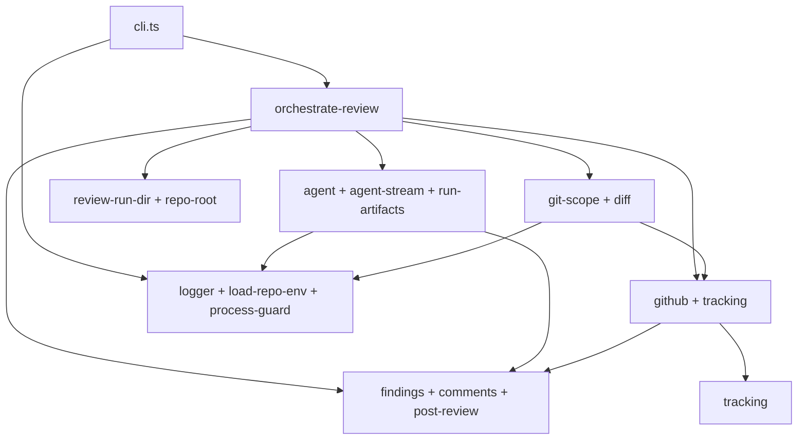

# reviewer-runner `src/` modular layout

## Product summary

The `reviewer-runner` package grew feature-by-feature (incremental review, analyzers, validator, observability, evals parity). Today **~26 TypeScript modules sit flat under `src/`**, which makes it hard to see boundaries (GitHub vs git vs Cursor SDK vs findings) or know where to add code.

Success is a **modular folder layout** under `packages/reviewer-runner/src/` that mirrors real domains, keeps **co-located tests**, preserves the **public API** (`index.ts` + `bin`), and updates **monorepo deep imports** (`evals/`, skill scripts) so CI and local runs stay green. Behavior and exports stay the same; this is **structure only** (no new features).

## Scope

### In scope

| # | Area | Deliverable |
|---|------|-------------|
| 1 | **Domain folders** | Move existing modules into bounded directories (see [Target layout](#target-layout)); one primary concern per folder. |
| 2 | **Entry points** | Keep `src/index.ts` (library barrel) and `src/cli.ts` (bin) at `src/` root; CLI remains thin wiring into orchestration. |
| 3 | **Imports** | Fix all internal relative imports; update external deep imports listed in [Consumers](#consumers). |
| 4 | **Public API stability** | `package.json` `main` / `types` and `index.ts` export surface **unchanged** (same named exports; paths may change internally only). |
| 5 | **Tests** | Vitest `include` still covers `src/**/*.test.ts`; tests move with their modules. |
| 6 | **Docs** | `packages/reviewer-runner/README.md`: short **Source layout** table mapping folder → responsibility. |
| 7 | **Build** | `tsc` `rootDir: src` unchanged; `npm run build` + `npm test -w reviewer-runner` pass. |

### Out of scope

| Item | Notes |
|------|--------|
| Behavior changes | No changes to orchestration, posting, skip rules, logger palette, or agent prompts. |
| Splitting large files | Optional follow-up; v1 is **move + import fixes** unless a file clearly belongs in two folders (then minimal extract only). |
| New package exports map in `package.json` | No `exports` subpath map unless needed for consumers; barrel stays `index.ts`. |
| `evals/` barrel / workspace imports | Follow-up PR: migrate `evals/` to `import from "reviewer-runner"`; this PR only updates deep `src/...` paths. |
| `evals/` architecture | Eval harness design is spec 06; only **import path** updates here. |
| Renaming public types/functions | Keep symbol names; folder/file renames only where they improve clarity and are low-churn. |
| `ai-review-run-artifacts/` at package root | Fixture/debug output; not part of `src/` layout (may stay or be gitignored separately). |

## Behavior

### Current module map (flat `src/`)

| Module | ~lines | Responsibility |
|--------|--------|----------------|
| `cli.ts` | 154 | Bin entry: env, guards, args, GitHub context, delegates to orchestration. |
| `orchestrate-review.ts` | 236 | **Pipeline**: tracking → git mode/scope → agent → parse findings → filter → post → tracking advance. |
| `agent.ts` | 175 | Cursor SDK agent: prompt, stream hookup, findings path, run artifacts on completion. |
| `agent-stream.ts` | 248 | SDK message → stdout (orchestrator prefix, subagent lifecycle, noise suppression). |
| `run-artifacts.ts` | 124 | Persist orchestrator/subagent JSON under review run dir. |
| `github.ts` | 226 | Octokit client, PR context, issue/review comments, inline post, known-issues from PR. |
| `tracking.ts` | 60 | Tracking comment marker, parse/format/select. |
| `git-scope.ts` | 284 | Incremental vs full, ancestry, PR file list, skip-agent rules. |
| `diff.ts` | 31 | Unified diff helper + env SHA resolution. |
| `findings.ts` | 98 | Findings v2 schema parse/validate. |
| `comments.ts` | 52 | Finding → inline review comment body. |
| `post-review.ts` | 34 | Known-issues JSON build + PR-scope filter before post. |
| `review-run-dir.ts` | 51 | Timestamped `.ai-code-review/<run>/` paths and constants. |
| `repo-root.ts` | 14 | Monorepo root via `git rev-parse`. |
| `load-repo-env.ts` | 21 | Load root `.env` (legacy package `.env` fallback). |
| `logger.ts` | 260 | ANSI wrapper logging for CI/local. |
| `process-guard.ts` | 84 | Suppress SDK bootstrap noise on stderr. |
| `index.ts` | 89 | Public re-exports for library consumers. |
| `skill-contract.test.ts` | 71 | Contract test vs `ai-code-review` SKILL.md (integration). |

Dependency spine (simplified):



### Target layout

**Approved v1** (aligns with `ledger-lite` feature folders; move-only, no file splits):

```
packages/reviewer-runner/src/
├── index.ts                    # public barrel (re-exports only)
├── cli.ts                      # bin entry
├── orchestration/
│   ├── orchestrate-review.ts
│   └── orchestrate-review.test.ts
├── agent/                      # Cursor SDK + run artifacts
│   ├── agent.ts
│   ├── agent.test.ts
│   ├── agent-stream.ts
│   ├── agent-stream.test.ts
│   ├── run-artifacts.ts
│   └── run-artifacts.test.ts
├── github/
│   ├── github.ts
│   ├── github.test.ts
│   ├── tracking.ts
│   └── tracking.test.ts
├── git/
│   ├── git-scope.ts
│   ├── git-scope.test.ts
│   └── diff.ts
├── findings/
│   ├── findings.ts
│   ├── comments.ts
│   ├── comments.test.ts
│   ├── post-review.ts
│   └── post-review.test.ts
├── paths/
│   ├── review-run-dir.ts
│   ├── review-run-dir.test.ts
│   ├── repo-root.ts
│   └── repo-root.test.ts
├── support/
│   ├── logger.ts
│   ├── logger.test.ts
│   ├── load-repo-env.ts
│   ├── load-repo-env.test.ts
│   ├── process-guard.ts
│   └── process-guard.test.ts
└── contract/
    └── skill-contract.test.ts
```

**Rules**

- **No cross-domain “utils” dump**: shared pieces used by one domain stay in that domain; only truly cross-cutting code lives in `support/`.
- **Import direction**: `orchestration/` may depend on all domains; `findings/` must not depend on `github/` or `agent/`; `support/` must not depend on product domains.
- **Barrel**: `index.ts` re-exports from subpaths (e.g. `./findings/findings.js`) so external `import { … } from "reviewer-runner"` stays stable after build.

### Consumers

These paths import **deep** `packages/reviewer-runner/src/...` today and must be updated in the same change (or immediately after):

| Consumer | Modules imported |
|----------|-------------------|
| `evals/run.ts` | `load-repo-env` |
| `evals/lib/*` | `findings`, `review-run-dir`, `agent`, `git-scope`, `load-repo-env` |
| `.cursor/skills/ai-code-review/scripts/*` | `findings` |
| `.cursor/skills/ai-code-review/SKILL.md` | example path to `review-run-dir` |

**Evals imports (this PR):** keep deep `src/...` imports; update paths to match new folders (e.g. `src/findings/findings.js`, `src/agent/agent.js`). **Follow-up PR:** workspace dependency + `import from "reviewer-runner"` barrel (export `loadRepoEnv` / `REPO_ROOT` if needed).

## API / events

| Surface | Contract |
|---------|----------|
| **npm package** | `main` → `dist/index.js`; same exported symbols as today. |
| **CLI** | `bin` → `dist/cli.js`; same flags and env vars (README). |
| **Internal** | Relative imports between domains use explicit paths; no circular deps. |

## Acceptance criteria

- [ ] `src/` uses the domain folders above (or an approved variant documented in Changelog).
- [ ] `npm run build -w reviewer-runner` succeeds; `dist/` layout matches pre-refactor (`cli.js`, `index.js`, mirrored subpaths).
- [ ] `npm test -w reviewer-runner` passes (all unit + contract tests).
- [ ] `index.ts` exports match pre-refactor symbols (grep or snapshot of export list).
- [ ] All consumers in [Consumers](#consumers) updated; `npm test -w evals` passes.
- [ ] Skill script tests under `.cursor/skills/ai-code-review/scripts/**/*.test.ts` still run via reviewer-runner vitest config.
- [ ] `README.md` includes a **Source layout** section with folder → one-line purpose.
- [ ] No new circular dependencies between domains (manual or lint note in plan).

## Validation checklist

- [ ] Acceptance criteria above are met
- [ ] `npm test -w reviewer-runner` and `npm test -w evals` pass
- [ ] Local smoke: `npm run review -w reviewer-runner -- --dry-run --skip-agent --base origin/main --head HEAD` from repo root
- [ ] Grep for stale imports: `packages/reviewer-runner/src/[a-z-]+\.ts` imports from old flat paths return zero (except `index.ts` / `cli.ts`)
- [ ] No open questions block release (or explicitly deferred)

## Open questions

| # | Question | Status | Answer / decision |
|---|----------|--------|-------------------|
| 1 | Folder name for SDK code: `cursor/`, `agent/`, or `sdk/`? | Resolved | **`agent/`** |
| 2 | Rename `orchestrate-review.ts` → `execute-review.ts` (or `review-pipeline.ts`) for clarity? | Resolved | **Keep `orchestrate-review.ts`** (move only) |
| 3 | Should `evals/` stop deep-importing `src/` and use package `index` / documented subpaths only? | Resolved | **Deep imports in this PR**; barrel via workspace package in a **follow-up PR** |
| 4 | Where should `skill-contract.test.ts` live: `contract/`, `tests/`, or stay beside `cli`? | Resolved | **`src/contract/skill-contract.test.ts`** |
| 5 | Split `github.ts` / `git-scope.ts` into smaller files in this PR or defer? | Resolved | **Move only** (no split in v1) |

_Status: `Open` · `Deferred` · `Resolved`_

## Changelog

| Date | Author | Change |
|------|--------|--------|
| 2026-05-31 | brainstorm | Initial draft from flat `src/` inventory and consumer grep |
| 2026-05-31 | human | Resolved OQ 1–5: `agent/`, keep `orchestrate-review`, deep evals imports + deferred barrel, `contract/`, move-only |
