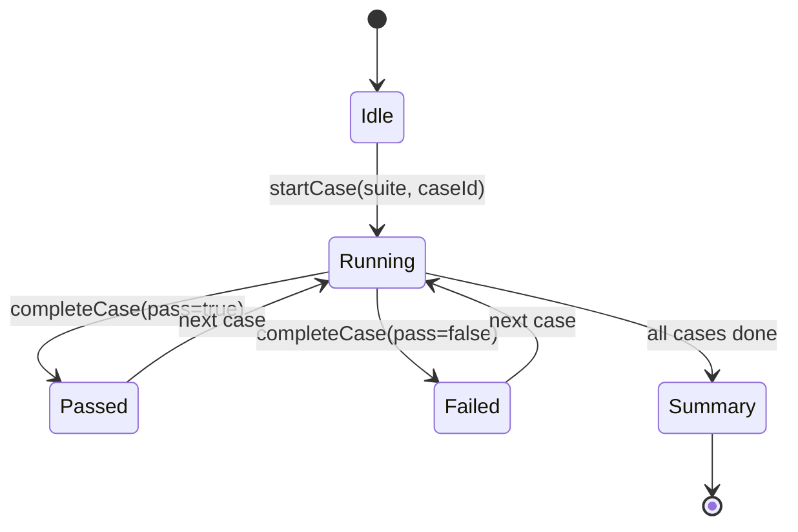

# Evals console reporter (Vitest-style UX)

**Status:** Pending

## Product summary

Running `npm run eval` today interleaves **eval harness output** with **full reviewer-runner agent streaming** (prompt box, `[orchestrator]` narration, sub-agent lifecycle, SDK INFO lines). A single E2E case can flood the terminal for ~90s while the pass/fail signal is buried at the end.

**Success:** The eval CLI shows a **scannable test run**—suites and cases with **pass / fail / running** states, a **spinner** on the active case, **green/red** when color is supported, and **one concise failure line** per failed case (e.g. judge reason: *"severity is minor while the rubric requires severity_min major"*). Agent orchestration detail remains available under `evals/out/<run-id>/` and via an explicit **verbose** flag—not on stdout by default.

This is **eval-runner UX only**. It does not change golden expectations, judge rubrics, or production CI review logging (spec 05).

## Scope

### In scope

| # | Area | Notes |
|---|------|--------|
| 1 | **Reporter module** | New `evals/lib/reporter.ts` (name flexible): owns all **harness** stdout; `run.ts` delegates display to it. |
| 2 | **Suite / case tree** | Group discovered cases by `suite` (existing `DiscoveredCase.suite`). Render hierarchy similar to Vitest: suite header, indented `caseId` lines. |
| 3 | **Pre-list pending** | At run start, print the **full** suite/case tree with every case in **pending** state (`○` or dim `RUN`). Cases transition pending → running → pass/fail as the sequential loop advances. |
| 4 | **Live status** | While a case runs: show **RUNNING** with animated spinner (TTY) or static `…` (non-TTY / `CI=true`). Only **one** case runs at a time (current sequential loop in `run.ts`). Update the pre-listed line in place on TTY. |
| 5 | **Terminal result line** | On completion: `PASS` / `FAIL` + duration (e.g. `98.1s`) + badges `retry=yes` / `judge=yes` **only when true** on the same line. Use `packages/reviewer-runner/src/support/logger.ts` color helpers (`shouldUseColor`, green/red) for consistency. |
| 6 | **Failure detail** | If `CaseRunResult.error` is set: print **one** indented line under the case (no stack unless thrown error). Do **not** print full `taskPrompt` on pass or fail by default. |
| 7 | **Quiet agent runs** | During eval execution, **suppress** reviewer-runner stream output to stdout: `log.prompt`, orchestrator lines, sub-agent lines, `log.step` / `log.ok` from `runReviewAgent`. Stream events still collected into existing `run-artifacts/` where E2E already writes them. |
| 8 | **SDK INFO suppression (quiet)** | In quiet mode, **attempt** to suppress Cursor SDK internal INFO on stdout (e.g. `LocalCursorRulesService load completed`). Investigate SDK env/options, stderr redirect, or stdout filter during eval only; document what worked in `plan.md`. If no hook exists, filter known patterns as last resort (eval process only). |
| 9 | **Component harness** | `runHarnessAgent` (analyzer / validator) already drains the stream silently; apply same quiet/SDK suppression when eval verbose is off. |
| 10 | **End summary** | Keep aggregate block (`passed X/Y`, duration, retries, judge count, by-suite breakdown) but style it like a Vitest **Summary** footer; include `Artifacts: evals/out/<run-id>/`. |
| 11 | **Verbose opt-in** | `--verbose` on eval CLI **or** `EVAL_VERBOSE=1`: restore current behavior (prompt box + orchestrator stream + task prompt dump + SDK INFO visible). Default: quiet. |
| 12 | **CI behavior** | In `CI=true`: no spinner animation (static indicator); colors when `FORCE_COLOR` / logger rules allow; no extra blank lines that break log grouping. |
| 13 | **Deterministic tests** | Unit tests for reporter formatting with `shouldUseColor` forced off (plain snapshots). Test pending → running → pass/fail transitions. Optional test that quiet hook does not call `log.orchestratorLine` when eval quiet flag is set. |
| 14 | **Docs** | Update `evals/README.md` CLI flags table for `--verbose` / `EVAL_VERBOSE`. |

### Out of scope

| # | Topic |
|---|--------|
| 1 | Parallel case execution or sharding. |
| 2 | Changing production `reviewer-runner` default logging in GitHub Actions (quiet is **eval-only** unless we later share a `logLevel` env). |
| 3 | Watch mode, HTML reports, or junit/xml export. |
| 4 | Hiding **eval harness** errors (missing API key, discovery empty)—those stay explicit on stderr. |
| 5 | Rewriting spec 06 golden cases or judge behavior. |
| 6 | Guaranteed silence of **all** third-party log lines in quiet mode (best-effort SDK suppression only). |

## Behavior

### Default run (`npm run eval`)

```
Eval run 2026-05-31T14-40-53-964Z · 6 cases

  analyzer-performance
    ○ n-plus-one                 ← pending at start; then updates in place
    ✓ n-plus-one (16.2s) judge=yes
  analyzer-security
    ✓ leaked-key (11.6s) judge=yes
  e2e
    ⠋ ledger-pipeline …          ← spinner while running
    ✗ ledger-pipeline (98.1s) judge=yes
      The finding correctly identifies the N+1 … severity_min major.
    ✓ ledger-security (85.5s) judge=yes
  validator
    ✓ dedup-positive (24.4s) judge=yes
    ✓ fp-filter-negative (121.5s) judge=yes

Summary
  Tests:  5 passed | 1 failed | 6 total
  Time:   357.2s
  Judge:  6/6 · Retries: 0

  By suite:
    analyzer-performance  1/1
    analyzer-security     1/1
    e2e                   1/2
    validator             2/2

Artifacts: evals/out/2026-05-31T14-40-53-964Z/
```

(Exact glyphs and spacing are implementation details; must read clearly without color and with color.)

### Reporter state machine



- **Pending:** printed once at `startRun` for every discovered case (full tree visible before first agent call).
- **Running:** update the pre-listed line in place on TTY (erase/redraw) so the tree does not grow unbounded.
- **Passed / Failed:** finalize line with duration and badges (`judge=yes`, `retry=yes` only when true); failed cases keep failure sub-line visible after run ends.

### Quiet agent integration

Preferred approach (single contract):

1. Add optional `logging?: "default" | "quiet"` to `RunReviewAgentOptions` in `packages/reviewer-runner/src/agent/agent.ts`.
2. When `quiet`: skip `log.prompt`, `log.step`, `log.ok`, and pass a no-op or stub into `logAgentStreamEvent` / `flushOrchestratorStream` (still **record** `streamEvents` for artifacts).
3. `runE2eCase` passes `logging: "quiet"` unless `EVAL_VERBOSE` / eval runner verbose flag is set.

Alternative (if we must not touch reviewer-runner): monkey-patch or env `REVIEWER_RUNNER_QUIET=1` read inside `logger.ts`—only if hook option is rejected during `/plan`.

Component path (`run-component.ts`) unchanged except eval runner sets the same env when verbose is off.

### What verbose restores

- Full `log.prompt()` box for E2E.
- All `[orchestrator]` and `[sub-agent]` lines.
- Per-case `Task prompt (N lines):` dump after each case (today’s `run.ts` behavior).

### Exit code

Unchanged: `0` if all pass, `1` if any fail.

## API / events

| Surface | Contract |
|---------|----------|
| CLI | `evals/run.ts` — add `--verbose`; document in `evals/lib/cli.ts` `CliOptions`. |
| Env | `EVAL_VERBOSE=1` — same as `--verbose` (CLI flag wins if both set). |
| `RunReviewAgentOptions` | Optional `logging?: "default" \| "quiet"` (reviewer-runner). |
| `EvalReporter` | `startRun(runId, cases[])`, `startCase(suite, caseId)`, `endCase(result)`, `printSummary(summary)`, `setVerbose(boolean)`. `startRun` prints pending tree. |

## Acceptance criteria

- [ ] At run start, **all** suite/case rows appear in **pending** state before the first case executes.
- [ ] Default `npm run eval` does **not** print orchestrator narration, sub-agent lifecycle lines, E2E prompt box, or SDK INFO lines on stdout (best-effort on SDK).
- [ ] Each case shows **suite/case** identity; **PASS/FAIL**, duration, and `judge=yes` / `retry=yes` badges (only when true) appear when the case finishes.
- [ ] The **currently running** case shows a spinner on a TTY (or non-animated running marker in CI).
- [ ] Failed cases print **exactly one** failure reason line sourced from `CaseRunResult.error` (judge/structural message).
- [ ] Passed cases do **not** print `taskPrompt` by default.
- [ ] `--verbose` / `EVAL_VERBOSE=1` restores today’s agent + task-prompt visibility for debugging.
- [ ] E2E still writes `run-artifacts/` and per-case dirs under `evals/out/<run-id>/`; quiet mode does not skip artifact capture.
- [ ] `npm test -w evals` includes reporter unit tests (no API key).
- [ ] Exit code semantics unchanged.

## Validation checklist

- [ ] Acceptance criteria above are met
- [ ] `npm test -w evals` passes
- [ ] Local `npm run eval` with `CURSOR_API_KEY` — confirm default output is readable and ledger-pipeline failure still shows judge line
- [ ] `npm run eval -- --verbose` — confirm orchestrator stream visible for one E2E case (spot check)
- [ ] `evals/README.md` documents verbose flag and env
- [ ] No regression to production `reviewer-runner` CI log volume when `logging` omitted (default `default`)

## Open questions

| # | Question | Status | Answer / decision |
|---|----------|--------|-------------------|
| 1 | Suppress SDK INFO (`LocalCursorRulesService load completed`) in quiet mode? | Resolved | **Yes — attempt** in quiet mode (SDK env, redirect, or eval-scoped stdout filter); document approach in `plan.md`. |
| 2 | `logging: "quiet"` on `runReviewAgent` vs env-only in logger? | Resolved | **`logging` option** on `RunReviewAgentOptions` (testable; default `default`). |
| 3 | Pre-list all cases as **pending** at start? | Resolved | **Yes** — full tree before first case runs. |
| 4 | `judge=yes` / `retry=yes` badges on result lines? | Resolved | **Yes** — show only when `judgeUsed` / `retry` is true (pass and fail). |

_Status: `Open` · `Deferred` · `Resolved`_

## Changelog

| Date | Author | Change |
|------|--------|--------|
| 2026-05-31 | brainstorm | Initial draft from terminal noise on `npm run eval` |
| 2026-05-31 | human | Resolved OQ1–4: pending pre-list, SDK suppression attempt, badges when true, `logging` option |
