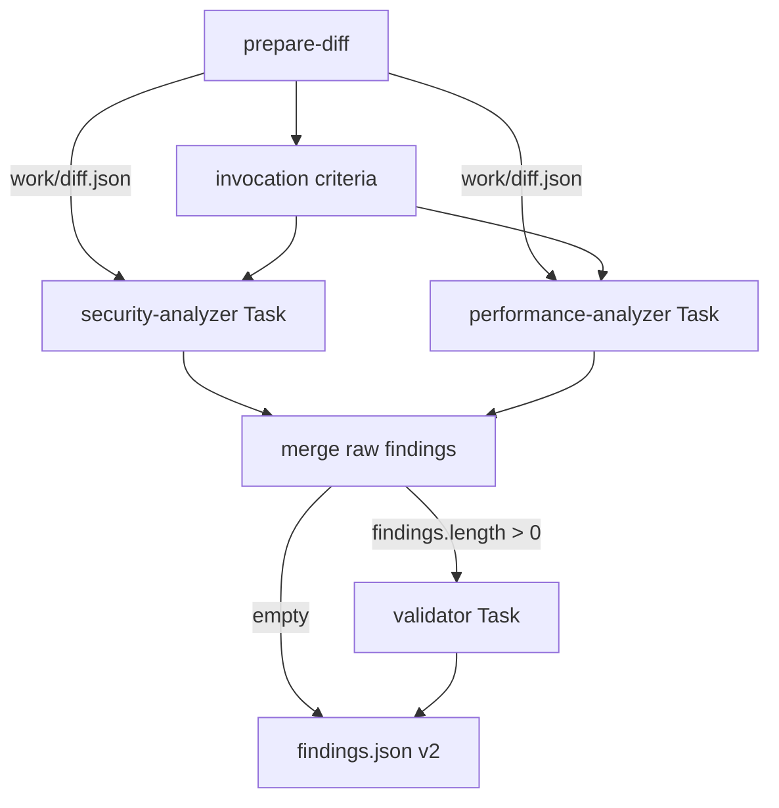

# AI Code Review (orchestrator)

You are the **orchestrator**. You do **not** perform heuristic analysis yourself. You coordinate:

**`prepare-diff` → work artifacts → invocation criteria → parallel analyzer Tasks → merge raw → validator Task → `.ai-code-review/findings.json` (v2)**

Subagent intelligence lives in `.cursor/agents/ai-code-review-{security,performance,validator}.md`. Analyzer Task prompts are **two lines only** (read path + write path). The validator Task prompt is **three lines only** (raw findings, known issues, output path).

## Architecture



| Layer | Responsibility |
|-------|----------------|
| **You (orchestrator)** | `prepare-diff`, stdout summary, write `work/diff.json`, select analyzers, launch analyzer Tasks, merge **raw**, launch validator when non-empty, map validated output → v2, fail closed on validator errors, log funnel summary |
| **Analyzer subagents** | Read diff JSON; domain analysis; write intermediate JSON; reply `Done` |
| **Validator subagent** | Five-phase funnel on raw findings; read reference docs; write `validator-output.json`; reply `Done` |
| **reviewer-runner** | Incremental scope, tracking, build `known-issues.json`, invoke agent, validate v2, **`filterFindingsForPost` = PR file scope only**, post inline comments |

You do **not** filter severity, dedupe findings, or run verification yourself — the validator owns the funnel after merge.

## Inputs

| Input | Source | Required |
|-------|--------|----------|
| Source ref / head SHA | Runner prompt or local (`HEAD`, branch, or commit) | Yes |
| Target ref / base branch | Runner prompt or local (e.g. `main`) | Yes |
| PR file list | Path to newline-separated paths (`--pr-files` for `prepare-diff`) | Yes in CI; recommended locally |
| Known issues JSON | Path to `{ "issues": [{ "file", "line", "message" }] }` | Optional (CI supplies; may be `[]`) |
| `Since commit: <sha>` | Runner (incremental) or human in local invocation | Optional — enables incremental diff |
| Repository root (`cwd`) | Workspace / runner | Yes |
| PR title | Runner / human | No |

**Local incremental:** only when the human supplies `Since commit: <full-sha>` in the prompt. Without it, run a **full** review from merge-base.

**Do not** paste a raw full-PR `git diff` as the primary input; use `prepare-diff` so scope, ignores, and metadata stay consistent with CI.

## Workflow checklist

1. Run `prepare-diff` (see below); read JSON from stdout or `--output` file.
2. Print the **mandatory diff run summary** to **stdout** (exact format below).
3. If incremental was requested but `metadata.is_incremental === false`, print `Warning: full review fallback` plus each `metadata.warnings` entry (prefix `Warning:`).
4. Ensure `.ai-code-review/work/` exists. **Write** `.ai-code-review/work/diff.json` with the same shape as the `prepare-diff` output (`metadata` + `files[]`).
5. **Select analyzers** (see [Invocation criteria](references/invocation-criteria.md)) — apply the same rules as `scripts/select-analyzers.ts`, or run:

   ```bash
   npx tsx -e "
   import { readFileSync, writeFileSync, mkdirSync } from 'node:fs';
   import { selectAnalyzers } from './.cursor/skills/ai-code-review/scripts/select-analyzers.ts';
   const diff = JSON.parse(readFileSync('.ai-code-review/work/diff.json','utf8'));
   const selected = selectAnalyzers(diff.files ?? []);
   console.log(selected.join(', '));
   "
   ```

6. **Log analyzers** to stdout (exactly one line):
   - Both: `Analyzers: security, performance`
   - Performance skipped: `Analyzers: security (skipped: performance)`
7. **Launch analyzer Tasks** in **one parallel batch** for each selected key. Do **not** launch Tasks for skipped analyzers.
8. **Collect** each analyzer output file (see file contract). On missing file or invalid JSON: **retry once** with the same two-line prompt; on second failure use `{ "analyzer": "<key>", "findings": [] }`.
9. **Merge raw** — concatenate analyzer outputs (no cross-analyzer dedup) and write `.ai-code-review/work/raw-findings.json` (v2 shape via `mergeAnalyzerOutputs`).
10. **Validator path:**
    - If `raw_findings.length === 0`: write `{ "version": "2", "findings": [] }` to `.ai-code-review/findings.json`; write `work/validator-summary.json` from `zeroedFilterSummary()`; **do not** launch validator Task.
    - Else: ensure `known-issues.json` exists (runner supplies path in prompt). Launch **one** validator Task (**no retry**).
11. **Collect validator output** — read `work/validator-output.json` only; validate with `parseValidatorOutput`; on missing/invalid → **abort** (do not write unvalidated `findings.json`).
12. **Map** validated output → `.ai-code-review/findings.json` (v2 via `mapValidatorToFindingsReport`); copy `filter_summary` → `work/validator-summary.json`.
13. Print **one stdout line**: `Validator funnel: <raw_input> → <final_output>` (from `filter_summary`).
14. Confirm `.ai-code-review/findings.json` exists before finishing.

## `prepare-diff`

Script: `.cursor/skills/ai-code-review/scripts/prepare-diff.ts`

```bash
npx tsx .cursor/skills/ai-code-review/scripts/prepare-diff.ts \
  --source <source-ref-or-sha> \
  --target <target-ref> \
  --pr-files <path-to-pr-files-list> \
  [--since-commit <full-sha>] \
  [--output .ai-code-review/prepare-diff.json]
```

## Mandatory diff run summary (stdout)

Print **after** `prepare-diff` and **before** launching analyzers. Values from `metadata`:

**Incremental** (`metadata.is_incremental === true`):

```text
Incremental: yes (since <full-sha>)
Diff stats: <n> files, +<added>/-<removed>
Excluded: <files_excluded> files
```

**Full review** (`metadata.is_incremental === false`):

```text
Incremental: no (base <full-sha>)
Diff stats: <n> files, +<added>/-<removed>
Excluded: <files_excluded> files
```

Then print `metadata.warnings` as `Warning: <message>` lines.

## Invocation criteria

Full rules: [references/invocation-criteria.md](references/invocation-criteria.md)

| Analyzer | When |
|----------|------|
| **security** | **Always** |
| **performance** | Any path/diff heuristic matches (see reference) |

## File contract (`.ai-code-review/`)

| Path | Role |
|------|------|
| `prepare-diff.json` | Optional; `--output` from `prepare-diff` |
| `work/diff.json` | Orchestrator → analyzers (copy of prepare-diff payload) |
| `work/security-findings.json` | Security subagent output |
| `work/performance-findings.json` | Performance subagent output |
| `work/raw-findings.json` | Merged analyzer findings pre-validation |
| `known-issues.json` | Runner-built; input to validator only |
| `work/validator-output.json` | Validator subagent output |
| `work/validator-summary.json` | Copy of `filter_summary` for logs/CI |
| `findings.json` | Final v2 report post-validator |

## Analyzer Tasks

Use the **Task** tool. `subagent_type` must match agent frontmatter `name` exactly.

| Analyzer | `subagent_type` | Output path |
|----------|-----------------|-------------|
| security | `ai-code-review-security-analyzer` | `.ai-code-review/work/security-findings.json` |
| performance | `ai-code-review-performance-analyzer` | `.ai-code-review/work/performance-findings.json` |

### Task prompt (exactly two lines — anti-pattern: duplicating `.md` rules here)

Security:

```text
Read diff from: .ai-code-review/work/diff.json
Write findings to: .ai-code-review/work/security-findings.json
```

Performance:

```text
Read diff from: .ai-code-review/work/diff.json
Write findings to: .ai-code-review/work/performance-findings.json
```

**Do not** trust Task return text for findings. Only read output files; validate JSON.

### Collect and retry (analyzers only)

1. Read output path after Task completes.
2. If missing or invalid JSON → retry **once** with the **same** two-line prompt.
3. Second failure → treat as `{ "analyzer": "<key>", "findings": [] }`.

### Merge raw

Build outputs in order: security (if run), then performance (if run). Skipped analyzers contribute `{ "findings": [] }`. Write result to `work/raw-findings.json`.

```bash
npx tsx -e "
import { readFileSync, writeFileSync, mkdirSync } from 'node:fs';
import { mergeAnalyzerOutputs } from './.cursor/skills/ai-code-review/scripts/merge-findings.ts';
const read = (p) => { try { return JSON.parse(readFileSync(p,'utf8')); } catch { return null; } };
const sec = read('.ai-code-review/work/security-findings.json') ?? { analyzer: 'security', findings: [] };
const perf = read('.ai-code-review/work/performance-findings.json') ?? { analyzer: 'performance', findings: [] };
const raw = mergeAnalyzerOutputs([sec, perf]);
mkdirSync('.ai-code-review/work', { recursive: true });
writeFileSync('.ai-code-review/work/raw-findings.json', JSON.stringify(raw, null, 2));
"
```

## Validator Task

Launch **only** when `raw-findings.json` has `findings.length > 0`. **No retry** on failure.

| Validator | `subagent_type` | Output path |
|-----------|-----------------|-------------|
| validator | `ai-code-review-validator` | `.ai-code-review/work/validator-output.json` |

### Task prompt (exactly three lines — data only)

```text
Read findings from: .ai-code-review/work/raw-findings.json
Read known issues from: .ai-code-review/known-issues.json
Write output to: .ai-code-review/work/validator-output.json
```

### Collect validator output

1. Read `work/validator-output.json` after Task completes.
2. Parse with `parseValidatorOutput` (see helper below).
3. If missing or invalid → **abort** the orchestration run (non-zero exit). Do **not** write `findings.json` from raw merge. Do **not** retry the validator Task.

### Map to final report

```bash
npx tsx -e "
import { readFileSync, writeFileSync } from 'node:fs';
import { parseValidatorOutput, mapValidatorToFindingsReport, zeroedFilterSummary } from './.cursor/skills/ai-code-review/scripts/validator-output.ts';
const rawPath = '.ai-code-review/work/raw-findings.json';
const raw = JSON.parse(readFileSync(rawPath,'utf8'));
if (!raw.findings?.length) {
  writeFileSync('.ai-code-review/findings.json', JSON.stringify({ version: '2', findings: [] }, null, 2));
  writeFileSync('.ai-code-review/work/validator-summary.json', JSON.stringify(zeroedFilterSummary(), null, 2));
  console.log('Validator funnel: 0 → 0');
} else {
  const out = parseValidatorOutput(JSON.parse(readFileSync('.ai-code-review/work/validator-output.json','utf8')));
  writeFileSync('.ai-code-review/findings.json', JSON.stringify(mapValidatorToFindingsReport(out), null, 2));
  writeFileSync('.ai-code-review/work/validator-summary.json', JSON.stringify(out.filter_summary, null, 2));
  console.log('Validator funnel: ' + out.filter_summary.raw_input + ' → ' + out.filter_summary.final_output);
}
"
```

## Output contract (final report — schema v2)

**Path:** `.ai-code-review/findings.json`

```json
{
  "version": "2",
  "findings": [
    {
      "analyzer": "security",
      "severity": "major",
      "file": "path/from/repo/root.ts",
      "line": 42,
      "issue": "what is wrong",
      "suggestion": "how to fix it"
    }
  ]
}
```

| Field | Rules |
|-------|--------|
| `version` | Must be `"2"` |
| `analyzer` | `security` \| `performance` on each finding |
| `severity` | `critical` \| `major` \| `minor` \| `enhancement` |
| `file` | Repo-relative path from reviewable diff set |
| `line` | Required for inline PR comments (new-file line number) |
| `issue` / `suggestion` | Non-empty strings |

**Empty review:** `{ "version": "2", "findings": [] }`.

**Do not** emit findings only in chat. **Do not** dump merged JSON in chat.

Example: [examples/findings.sample.json](examples/findings.sample.json)

## Known issues

The runner builds `.ai-code-review/known-issues.json` from existing PR inline comments. Pass the path to the validator Task prompt only.

- **Do not** filter or dedupe in the orchestrator or analyzer subagents.
- **Do not** dedupe at merge — cross-analyzer dedup is validator Phase 1.
- Known-issue skip is validator Phase 3.
- The runner's `filterFindingsForPost` drops findings whose `file` is **outside the PR file list** only (not known-issues dedup at post time).

## GitHub posting (runner-owned)

The runner formats inline comments (analyzer title + severity emoji + suggestion). Subagents and you write **JSON only**.

## Out of scope

- Multi-batch `batch-{i}.json` for large PRs
- Analyzers other than `security` and `performance`
- Automatic **retry** of validator Task (analyzers: one retry only)
- `evals/` harness
- Workflow artifact upload for `filter_summary` (file + stdout only in v1)
- Posting GitHub comments directly
- External tracking state (runner owns PR tracking comment)
- Ticket cross-reference, `codebase-patterns.md`, `category` on findings
