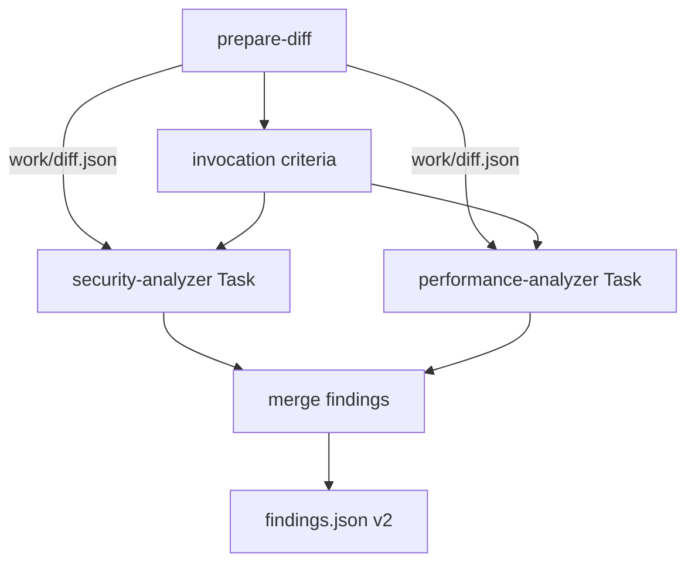

# AI Code Review (orchestrator)

You are the **orchestrator**. You do **not** perform heuristic analysis yourself. You coordinate:

**`prepare-diff` → work artifacts → invocation criteria → parallel analyzer Tasks → merge → `.ai-code-review/findings.json` (v2)**

Subagent intelligence lives in `.cursor/agents/ai-code-review-{security,performance}-analyzer.md`. Your Task prompts to analyzers are **two lines only** (read path + write path).

## Architecture



| Layer | Responsibility |
|-------|----------------|
| **You (orchestrator)** | `prepare-diff`, stdout summary, write `work/diff.json`, select analyzers, launch Tasks, collect outputs, merge, write final file |
| **Analyzer subagents** | Read diff JSON; domain analysis; write intermediate JSON; reply `Done` |
| **reviewer-runner** | Incremental scope, tracking, known-issues filter, validate v2, post inline comments |

You do **not** filter severity, dedupe findings, or run a validator step.

## Inputs

| Input | Source | Required |
|-------|--------|----------|
| Source ref / head SHA | Runner prompt or local (`HEAD`, branch, or commit) | Yes |
| Target ref / base branch | Runner prompt or local (e.g. `main`) | Yes |
| PR file list | Path to newline-separated paths (`--pr-files` for `prepare-diff`) | Yes in CI; recommended locally |
| Known issues JSON | Path to `{ "issues": [{ "file", "line", "message" }] }` | Optional (CI supplies; may be `[]`) |
| `Since commit: <sha>` | Runner (incremental) or human in local invocation | Optional — enables incremental diff |
| Repository root (`cwd`) | Workspace / runner | Yes |
| PR title | Runner / human | No |

**Local incremental:** only when the human supplies `Since commit: <full-sha>` in the prompt. Without it, run a **full** review from merge-base.

**Do not** paste a raw full-PR `git diff` as the primary input; use `prepare-diff` so scope, ignores, and metadata stay consistent with CI.

## Workflow checklist

1. Run `prepare-diff` (see below); read JSON from stdout or `--output` file.
2. Print the **mandatory diff run summary** to **stdout** (exact format below).
3. If incremental was requested but `metadata.is_incremental === false`, print `Warning: full review fallback` plus each `metadata.warnings` entry (prefix `Warning:`).
4. Ensure `.ai-code-review/work/` exists. **Write** `.ai-code-review/work/diff.json` with the same shape as the `prepare-diff` output (`metadata` + `files[]`).
5. **Select analyzers** (see [Invocation criteria](references/invocation-criteria.md)) — apply the same rules as `scripts/select-analyzers.ts`, or run:

   ```bash
   npx tsx -e "
   import { readFileSync, writeFileSync, mkdirSync } from 'node:fs';
   import { selectAnalyzers } from './.cursor/skills/ai-code-review/scripts/select-analyzers.ts';
   const diff = JSON.parse(readFileSync('.ai-code-review/work/diff.json','utf8'));
   const selected = selectAnalyzers(diff.files ?? []);
   console.log(selected.join(', '));
   "
   ```

6. **Log analyzers** to stdout (exactly one line):
   - Both: `Analyzers: security, performance`
   - Performance skipped: `Analyzers: security (skipped: performance)`
7. **Launch analyzer Tasks** in **one parallel batch** for each selected key. Do **not** launch Tasks for skipped analyzers.
8. **Collect** each analyzer output file (see file contract). On missing file or invalid JSON: **retry once** with the same two-line prompt; on second failure use `{ "analyzer": "<key>", "findings": [] }`.
9. **Merge** into schema v2 (same semantics as `scripts/merge-findings.ts` — concatenate, no cross-analyzer dedup). For skipped analyzers, use empty `findings`.
10. **Overwrite** `.ai-code-review/findings.json` at repo root. Confirm the file exists before finishing.

## `prepare-diff`

Script: `.cursor/skills/ai-code-review/scripts/prepare-diff.ts`

```bash
npx tsx .cursor/skills/ai-code-review/scripts/prepare-diff.ts \
  --source <source-ref-or-sha> \
  --target <target-ref> \
  --pr-files <path-to-pr-files-list> \
  [--since-commit <full-sha>] \
  [--output .ai-code-review/prepare-diff.json]
```

## Mandatory diff run summary (stdout)

Print **after** `prepare-diff` and **before** launching analyzers. Values from `metadata`:

**Incremental** (`metadata.is_incremental === true`):

```text
Incremental: yes (since <full-sha>)
Diff stats: <n> files, +<added>/-<removed>
Excluded: <files_excluded> files
```

**Full review** (`metadata.is_incremental === false`):

```text
Incremental: no (base <full-sha>)
Diff stats: <n> files, +<added>/-<removed>
Excluded: <files_excluded> files
```

Then print `metadata.warnings` as `Warning: <message>` lines.

## Invocation criteria

Full rules: [references/invocation-criteria.md](references/invocation-criteria.md)

| Analyzer | When |
|----------|------|
| **security** | **Always** |
| **performance** | Any path/diff heuristic matches (see reference) |

## File contract (`.ai-code-review/`)

| Path | Role |
|------|------|
| `prepare-diff.json` | Optional; `--output` from `prepare-diff` |
| `work/diff.json` | Orchestrator → analyzers (copy of prepare-diff payload) |
| `work/security-findings.json` | Security subagent output |
| `work/performance-findings.json` | Performance subagent output |
| `findings.json` | Final v2 report for `reviewer-runner` |

## Analyzer Tasks

Use the **Task** tool. `subagent_type` must match agent frontmatter `name` exactly.

| Analyzer | `subagent_type` | Output path |
|----------|-----------------|-------------|
| security | `ai-code-review-security-analyzer` | `.ai-code-review/work/security-findings.json` |
| performance | `ai-code-review-performance-analyzer` | `.ai-code-review/work/performance-findings.json` |

### Task prompt (exactly two lines — anti-pattern: duplicating `.md` rules here)

Security:

```text
Read diff from: .ai-code-review/work/diff.json
Write findings to: .ai-code-review/work/security-findings.json
```

Performance:

```text
Read diff from: .ai-code-review/work/diff.json
Write findings to: .ai-code-review/work/performance-findings.json
```

**Do not** trust Task return text for findings. Only read output files; validate JSON.

### Collect and retry

1. Read output path after Task completes.
2. If missing or invalid JSON → retry **once** with the **same** two-line prompt.
3. Second failure → treat as `{ "analyzer": "<key>", "findings": [] }`.

### Merge

Build outputs in order: security (if run), then performance (if run). Skipped analyzers contribute `{ "findings": [] }`.

Optional helper (same logic as `scripts/merge-findings.ts`):

```bash
npx tsx -e "
import { readFileSync, writeFileSync } from 'node:fs';
import { mergeAnalyzerOutputs } from './.cursor/skills/ai-code-review/scripts/merge-findings.ts';
const read = (p) => { try { return JSON.parse(readFileSync(p,'utf8')); } catch { return null; } };
const sec = read('.ai-code-review/work/security-findings.json') ?? { analyzer: 'security', findings: [] };
const perf = read('.ai-code-review/work/performance-findings.json') ?? { analyzer: 'performance', findings: [] };
writeFileSync('.ai-code-review/findings.json', JSON.stringify(mergeAnalyzerOutputs([sec, perf]), null, 2));
"
```

## Output contract (final report — schema v2)

**Path:** `.ai-code-review/findings.json`

```json
{
  "version": "2",
  "findings": [
    {
      "analyzer": "security",
      "severity": "major",
      "file": "path/from/repo/root.ts",
      "line": 42,
      "issue": "what is wrong",
      "suggestion": "how to fix it"
    }
  ]
}
```

| Field | Rules |
|-------|--------|
| `version` | Must be `"2"` |
| `analyzer` | `security` \| `performance` on each finding |
| `severity` | `critical` \| `major` \| `minor` \| `enhancement` |
| `file` | Repo-relative path from reviewable diff set |
| `line` | Required for inline PR comments (new-file line number) |
| `issue` / `suggestion` | Non-empty strings |

**Empty review:** `{ "version": "2", "findings": [] }`.

**Do not** emit findings only in chat. **Do not** dump merged JSON in chat.

Example: [examples/findings.sample.json](examples/findings.sample.json)

## Known issues

If the runner supplies known-issues JSON, pass it as context only. **Do not** filter or dedupe in the orchestrator or subagents — the runner applies `filterFindingsForPost` after reading `findings.json`.

## GitHub posting (runner-owned)

The runner formats inline comments (analyzer title + severity emoji + suggestion). Subagents and you write **JSON only**.

## Out of scope

- Multi-batch `batch-{i}.json` for large PRs
- Validator agent (semantic dedup, category filter)
- Analyzers other than `security` and `performance`
- `evals/` harness
- Posting GitHub comments directly
- External tracking state (runner owns PR tracking comment)
