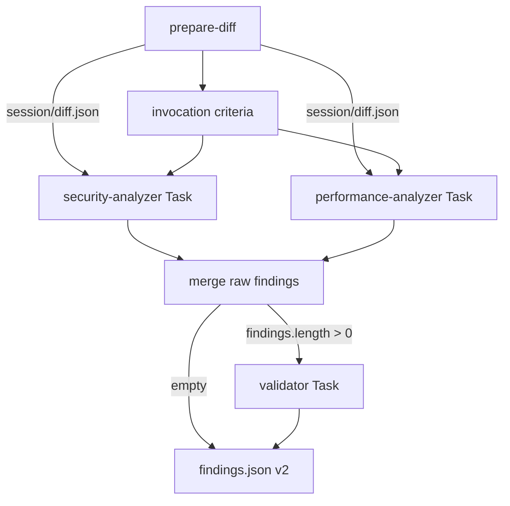

# AI Code Review (orchestrator)

You are the **orchestrator**. You do **not** perform heuristic analysis yourself. You coordinate:

**`prepare-diff` → ephemeral session IPC → invocation criteria → parallel analyzer Tasks → merge raw → validator Task → `.ai-code-review/findings.json` (v2)**

Subagent intelligence lives in `.cursor/agents/ai-code-review-{security,performance,validator}.md`. Analyzer Task prompts are **two lines only** (read path + write path). The validator Task prompt is **three lines only** (raw findings, known issues, output path).

## Architecture



| Layer | Responsibility |
|-------|----------------|
| **You (orchestrator)** | Step 0 TodoWrite; session dir + manifest; `prepare-diff`; English **narration** in assistant messages; select analyzers; launch analyzer Tasks; merge **raw**; launch validator when non-empty; map validated output → v2; fail closed on validator errors; snapshot session → `run-artifacts/session/` |
| **Analyzer subagents** | Read diff JSON; domain analysis; write intermediate JSON; reply `Done` |
| **Validator subagent** | Five-phase funnel on raw findings; read reference docs; write `validator-output.json`; reply `Done` |
| **reviewer-runner** | Incremental scope, tracking, build `known-issues.json`, invoke agent, validate v2, **`filterFindingsForPost` = PR file scope only**, post inline comments |

You do **not** filter severity, dedupe findings, or run verification yourself — the validator owns the funnel after merge.

## Step 0 — TodoWrite (mandatory, IDE only)

**First tool call** of the orchestration turn — before **any** other tool (including `prepare-diff`, Bash, Read, or Task).

**Do not** invent or paraphrase `content` strings (e.g. “Verify inputs…”). Use the JSON below **character-for-character** — including the `1-` … `7-` prefixes.

### Step 0 init — copy verbatim into `TodoWrite`

```json
{
  "merge": false,
  "todos": [
    { "id": "prereq", "content": "1- Prerequisites check", "status": "in_progress" },
    { "id": "metadata", "content": "2- Extract PR metadata", "status": "pending" },
    { "id": "diff", "content": "3- Obtain and prepare diff", "status": "pending" },
    { "id": "analyzers", "content": "4- Run analyzer sub-agents", "status": "pending" },
    { "id": "collect", "content": "5- Collect results", "status": "pending" },
    { "id": "validate", "content": "6- Run validator", "status": "pending" },
    { "id": "report", "content": "7- Generate JSON report", "status": "pending" }
  ]
}
```

State machine (status-only updates): [references/progress-todos.md](references/progress-todos.md)

1. First tool call: `TodoWrite` with the JSON above (exactly **7** items; no extra todos).
2. At the **start** of each workflow step below, `TodoWrite` with `merge: true` — update **only** `status` per the state machine (never change `content`).
3. Mark `report` → `completed` only after `.ai-code-review/findings.json` exists **and** the final narration line is emitted (see Progress visibility).
4. **Never** emit TodoWrite lines in orchestrator narration.

## Session directory

Create immediately after Step 0 (before `prepare-diff`):

```bash
npx tsx -e "
import { mkdtempSync, writeFileSync, mkdirSync } from 'node:fs';
import { tmpdir } from 'node:os';
import { join } from 'node:path';
const sessionDir = process.env.AI_CODE_REVIEW_SESSION_DIR
  ? process.env.AI_CODE_REVIEW_SESSION_DIR
  : mkdtempSync(join(tmpdir(), 'ai-code-review-'));
const manifest = {
  version: '1',
  sessionDir,
  diff: join(sessionDir, 'diff.json'),
  security: join(sessionDir, 'security-findings.json'),
  performance: join(sessionDir, 'performance-findings.json'),
  raw: join(sessionDir, 'raw-findings.json'),
  validatorOut: join(sessionDir, 'validator-output.json'),
  validatorSummary: join(sessionDir, 'validator-summary.json'),
};
writeFileSync(join(sessionDir, 'session-manifest.json'), JSON.stringify(manifest, null, 2));
console.log(sessionDir);
"
```

- If `AI_CODE_REVIEW_SESSION_DIR` is set (absolute path), **reuse** it; do not create a new temp dir.
- All analyzer/validator IPC files live under `sessionDir` only — **not** under `.ai-code-review/work/`.
- Read paths from `session-manifest.json` for Task prompts and inline scripts.

## Inputs

| Input | Source | Required |
|-------|--------|----------|
| Source ref / head SHA | Runner prompt or local (`HEAD`, branch, or commit) | Yes |
| Target ref / base branch | Runner prompt or local (e.g. `main`) | Yes |
| PR file list | Path to newline-separated paths (`--pr-files` for `prepare-diff`) | Yes in CI; recommended locally |
| Known issues JSON | Path to `{ "issues": [{ "file", "line", "message" }] }` | Optional (CI supplies; may be `[]`) |
| `Since commit: <sha>` | Runner (incremental) or human in local invocation | Optional — enables incremental diff |
| Repository root (`cwd`) | Workspace / runner | Yes |

**Local incremental:** only when the human supplies `Since commit: <full-sha>` in the prompt. Without it, run a **full** review from merge-base.

**Do not** paste a raw full-PR `git diff` as the primary input; use `prepare-diff` so scope, ignores, and metadata stay consistent with CI.

## Progress visibility

**Orchestrator narration** = plain English lines in your **assistant message text** (the chat reply), in order, **immediately before** the corresponding tool action. In CI, `reviewer-runner` forwards each line of assistant text with an `[orchestrator]` prefix (it does **not** read Shell tool stdout).

| Surface | Mechanism |
|---------|-----------|
| **Progress lines + emoji blocks** | Assistant message text (this section) |
| **IDE step checklist** | TodoWrite only (Step 0) — never paste todo lines into narration |

### Narration pacing (mandatory)

Operators must see progress **as each phase starts**, not a silent run followed by a recap. **Do not** run the full pipeline in one assistant turn and print mid-run lines only when closing.

**Rules:**

1. **Narration before tools** — In every turn that invokes tools, put the phase’s canonical line(s) at the **top** of the assistant message, then call **only** the tools for that phase.
2. **One major phase per turn** — Do not combine tool batches from different rows of the pacing table below in the same assistant turn.
3. **Mid-run lines are not closing content** — Lines such as `Diff ready…`, `Launching…`, `Collected…`, and `Running validator…` must **already** have been sent in earlier turns. The **final** turn contains **only** the consolidated 📋–🎯 block and `Report written to:` (no replay of mid-run lines).

| Turn | Narration first (in this order) | Tools allowed in this turn **only** |
|------|----------------------------------|-------------------------------------|
| A | Start line | TodoWrite Step 0; session `session-manifest.json`; `prepare-diff` |
| B | `Diff ready; selecting analyzers.`; `Warning:` lines when incremental fallback applies; `Analyzers: …` | TodoWrite metadata/diff; write session `diff.json`; select analyzers |
| C | `Launching selected analyzer sub-agents in parallel.` (or subset) | Analyzer Task(s) — parallel batch OK |
| D | `Collected analyzer output; merging raw findings.` | Read analyzer outputs; merge `raw-findings.json` |
| E | `Running validator on raw findings.` **or** `All analyzers returned no findings; skipping validator.` | Validator Task **or** write empty `findings.json` + zeroed summary |
| F | Consolidated 📋 → 📊 → 🔬 → 📥 → ⏭️/✅ → 🎯; then `Report written to:` | Map validator → v2; snapshot session; TodoWrite `report` completed — **no** `prepare-diff`, analyzer Tasks, or validator Task |

Turns **A–E** use **plain** one-sentence lines only (no 📋 📊 🔬 📥 ⏭️/✅). Turn **F** is the **only** turn that may emit emoji blocks.

**Forbidden (common failure modes):**

| Anti-pattern | Why it fails |
|--------------|--------------|
| **Deferred narration dump** | Emitting `Diff ready…`, `Launching…`, `Collected…`, and/or `Running validator…` in the **same** message as the consolidated block **after** all tools finished |
| **Single-turn full pipeline** | Turns A–E collapsed into one turn (session → prepare-diff → Tasks → merge → validator → `findings.json`) with narration only at the end |
| **Recap before close** | Re-printing mid-run lines immediately before 📋 📊 🔬 📥 (duplicates stream noise) |

If the IDE batches text with tools into one bubble, **still** use turns A–F so streaming can forward each line when that turn is emitted.

**During the run:** emit only **plain one-sentence** English lines (no emoji blocks) before each phase — see table below.

**Once at the end (turn F only):** emit the **consolidated final block** (all 📋 📊 🔬 📥 ⏭️/✅ + 🎯) in a **single** assistant message, then **exactly one** `Report written to:` line — **stop**. Do **not** print 📋 📊 🔬 📥 ⏭️/✅ earlier in the run. Do **not** add recap paragraphs, `---`, JSON snippets, or session path dumps after 🎯.

| When | Line (exact wording) |
|------|------------------------|
| Start | `I'll run the ai-code-review skill with the PR parameters from the prompt.` |
| After `prepare-diff` | `Diff ready; selecting analyzers.` |
| After `Analyzers:` line, before Tasks | `Launching selected analyzer sub-agents in parallel.` (or name the selected set if only one) |
| After analyzer files read | `Collected analyzer output; merging raw findings.` |
| Before validator Task | `Running validator on raw findings.` |
| Raw empty, skip validator | `All analyzers returned no findings; skipping validator.` |
| After `findings.json` written | **Consolidated final block** (see [Orchestrator narration blocks](#orchestrator-narration-blocks-fixed-templates)) |
| Final | `Report written to: .ai-code-review/findings.json` |

- Tool work stays silent in narration (no tool names, Task prompts, or bash).
- `Warning:` / `⚠️` lines when `metadata.warnings` or incremental fallback apply (may appear when they occur; do not duplicate them in the consolidated block unless still relevant).

**Do not use Shell/Bash solely to emit progress lines** (`echo`, `node -e` with `console.log`, etc.) — operators and CI will not see them as orchestrator progress.

**Do not put in narration:** Task prompts, `tool_use` narration, env dumps, session paths (except `Warning:`), script JSON (e.g. analyzer selection arrays), findings tables/lists (severity/file/line/issue), `Validator funnel:` (already in the ✅ block), horizontal rules (`---`), post-close recaps (“The incremental diff…”, “Both analyzers…”, “Final report: …”), or extra content on the final path line.

**After `🎯 Review complete:`** — at most **one** more line (`Report written to: .ai-code-review/findings.json`). No other assistant text.

## Workflow checklist

Pacing: follow [Narration pacing](#narration-pacing-mandatory) turns **A–F** — end the assistant message (with narration) before starting the next turn’s tools.

1. **Turn A — Step 0:** TodoWrite init (see above).
2. **Turn A — Session:** Create or reuse session dir; write `session-manifest.json`.
3. **Turn A — Todo:** `prereq` in_progress (from step 0).
4. **Turn A:** Run `prepare-diff` (see below); read JSON from stdout or `--output` file — **stop**; do not start analyzer Tasks in this turn.
5. **Turn B — Todo:** `prereq` completed; `metadata` in_progress → then completed after metadata read.
6. **Turn B:** Emit `Diff ready; selecting analyzers.` in assistant text (do **not** emit 📋/📊 yet — turn **F** only).
7. **Turn B:** If incremental was requested but `metadata.is_incremental === false`, emit `Warning: full review fallback` plus each `metadata.warnings` entry (prefix `Warning:`).
8. **Turn B — Todo:** `diff` in_progress. **Write** `{sessionDir}/diff.json` with the same shape as `prepare-diff` output (`metadata` + `files[]`).
9. **Select analyzers** (see [Invocation criteria](references/invocation-criteria.md)) — apply the same rules as `scripts/select-analyzers.ts`, or run:

   ```bash
   SESSION=$(node -p "JSON.parse(require('fs').readFileSync(process.env.AI_CODE_REVIEW_SESSION_DIR + '/session-manifest.json','utf8')).sessionDir")
   npx tsx -e "
   import { readFileSync } from 'node:fs';
   import { selectAnalyzers } from './.cursor/skills/ai-code-review/scripts/select-analyzers.ts';
   const manifest = JSON.parse(readFileSync(process.env.AI_CODE_REVIEW_SESSION_DIR + '/session-manifest.json','utf8'));
   const diff = JSON.parse(readFileSync(manifest.diff,'utf8'));
   const selected = selectAnalyzers(diff.files ?? []);
   require('fs').writeFileSync(process.env.AI_CODE_REVIEW_SESSION_DIR + '/selected-analyzers.json', JSON.stringify(selected));
   "
   ```

   Read `selected-analyzers.json` for the list; **do not** paste that JSON into narration.

10. **Turn B — Log analyzers** in narration (exactly one line):
    - Both: `Analyzers: security, performance`
    - Performance skipped: `Analyzers: security (skipped: performance)`
11. **Turn B end / Turn C start:** Emit `Launching selected analyzer sub-agents in parallel.` (or name subset) — then **Todo:** `diff` completed; `analyzers` in_progress. **End turn B** before analyzer Tasks unless `Launching…` is the last line of turn B and Tasks are turn C only.
12. **Turn C:** **Launch analyzer Tasks** in **one parallel batch** for each selected key. Do **not** launch Tasks for skipped analyzers. Do **not** merge raw or run validator in this turn. Keep `analyzers` in_progress until step 13 starts.
13. **Turn D — Todo:** `analyzers` completed; `collect` in_progress. Emit `Collected analyzer output; merging raw findings.` in assistant text before merge.
14. **Turn D:** **Collect** each analyzer output file (manifest paths). On missing file or invalid JSON: **retry once** with the same two-line prompt; on second failure use `{ "analyzer": "<key>", "findings": [] }`.
15. **Turn D:** **Merge raw** — write `{sessionDir}/raw-findings.json` (v2 shape via `mergeAnalyzerOutputs`).
16. **Turn E — Validator path:**
    - If `raw_findings.length === 0`: emit `All analyzers returned no findings; skipping validator.` in assistant text; write `{ "version": "2", "findings": [] }` to `.ai-code-review/findings.json`; write `.ai-code-review/validator-summary.json` from `zeroedFilterSummary()`; **do not** launch validator Task.
    - Else: emit `Running validator on raw findings.` in assistant text; **Todo:** `collect` completed; `validate` in_progress. Ensure `known-issues.json` exists. Launch **one** validator Task (**no retry**).
17. **Turn E:** **Collect validator output** — read manifest `validatorOut` only; validate with `parseValidatorOutput`; on missing/invalid → **abort** (do not write unvalidated `findings.json`). Emit `Warning: session files kept at <sessionDir>` in assistant text; snapshot session if possible; **do not** delete temp.
18. **Turn E:** **Map** validated output → `.ai-code-review/findings.json` (v2); copy `filter_summary` → `.ai-code-review/validator-summary.json` and session `validatorSummary`.
19. **Turn F — Todo:** `validate` completed; `report` in_progress.
20. **Turn F:** Emit the **consolidated final block** once in assistant text (📋 📊 🔬 📥 ⏭️ or ✅ in order, then 🎯 severity counts from **final** `findings.json`) — see templates below. **Do not** paste a findings table, list, or per-finding details (those live only in `.ai-code-review/findings.json`). Use exact `⏭️ Validator skipped:` (emoji + bold title) when skipping validator. **Do not** repeat mid-run lines from turns B–E.
21. **Turn F:** Emit **exactly one** closing line in assistant text: `Report written to: .ai-code-review/findings.json` — then **end orchestrator narration** (no recap, `---`, or file dumps).
22. **Turn F — Todo:** `report` completed.
23. **Turn F:** **Session snapshot & cleanup:** Ensure `.ai-code-review/run-artifacts/` exists; copy session dir → `.ai-code-review/run-artifacts/session/`; best-effort `rm -rf` on temp session dir (skip delete on validator abort).

## `prepare-diff`

Script: `.cursor/skills/ai-code-review/scripts/prepare-diff.ts`

```bash
npx tsx .cursor/skills/ai-code-review/scripts/prepare-diff.ts \
  --source <source-ref-or-sha> \
  --target <target-ref> \
  --pr-files <path-to-pr-files-list> \
  [--since-commit <full-sha>] \
  [--output .ai-code-review/prepare-diff.json]
```

## Orchestrator narration blocks (fixed templates)

Emit in **assistant message text** (not Shell), **once** in the consolidated final block after `findings.json` exists. Use values from `prepare-diff` `metadata` / session files. Machine line `Analyzers:` (during run) stays **plain** (no emoji).

**Anti-patterns:** emitting 📋 📊 after `prepare-diff`; 🔬 📥 ✅ before turn **F**; [deferred narration dump](#narration-pacing-mandatory) (mid-run lines only at close); [single-turn full pipeline](#narration-pacing-mandatory).

| Block | Template |
|-------|----------|
| Metadata | `📋 PR Metadata:` — source/target branch, incremental yes/no + since SHA |
| Diff | `📊 Diff stats:` — file count, +/- lines, excluded count; label full vs incremental |
| Analyzers | `🔬 Analyzers:` — selected list and `(skipped: …)` when applicable |
| Collect | `📥 Collected results:` — raw count, categories from analyzers present |
| Validator skip | `⏭️ Validator skipped: …` when raw empty (use instead of ✅) |
| Validator done | `✅ Validator complete: {raw} raw → {final} validated` |
| Close | `🎯 Review complete:` severity **counts only** from **final** `findings.json` (no per-finding table or list) |

**Consolidated final block order:** 📋 → 📊 → 🔬 → 📥 → (⏭️ **or** ✅) → 🎯 — then `Report written to:`.

## Invocation criteria

Full rules: [references/invocation-criteria.md](references/invocation-criteria.md)

| Analyzer | When |
|----------|------|
| **security** | **Always** |
| **performance** | Any path/diff heuristic matches (see reference) |

## File contract

### Durable (`.ai-code-review/` at repo root)

| Path | Role |
|------|------|
| `findings.json` | Final v2 report (runner input) |
| `validator-summary.json` | Copy of `filter_summary` (or zeroed on skip) |
| `known-issues.json` | Runner-built; validator input only |
| `pr-files.txt` | Runner-built PR file list |
| `prepare-diff.json` | Optional; `--output` from `prepare-diff` |
| `run-artifacts/**` | SDK trace + `session/` IPC snapshot (spec 05) |

### Ephemeral (session dir under `$TMPDIR` or `AI_CODE_REVIEW_SESSION_DIR`)

| File | Role |
|------|------|
| `session-manifest.json` | Path map (schema version `"1"`) |
| `diff.json` | Orchestrator → analyzers |
| `security-findings.json` | Security subagent output |
| `performance-findings.json` | Performance subagent output |
| `raw-findings.json` | Merged pre-validation |
| `validator-output.json` | Validator subagent output |
| `validator-summary.json` | In-session copy of `filter_summary` |

**Removed:** persistent `.ai-code-review/work/` — do not create it.

## Analyzer Tasks

Use the **Task** tool. `subagent_type` must match agent frontmatter `name` exactly.

| Analyzer | `subagent_type` | Output (manifest key) |
|----------|-----------------|------------------------|
| security | `ai-code-review-security-analyzer` | `security` |
| performance | `ai-code-review-performance-analyzer` | `performance` |

### Task prompt (exactly two lines — use absolute paths from manifest)

Security:

```text
Read diff from: /var/folders/.../ai-code-review-abc/diff.json
Write findings to: /var/folders/.../ai-code-review-abc/security-findings.json
```

Performance:

```text
Read diff from: /var/folders/.../ai-code-review-abc/diff.json
Write findings to: /var/folders/.../ai-code-review-abc/performance-findings.json
```

**Do not** trust Task return text for findings. Only read output files; validate JSON.

### Collect and retry (analyzers only)

1. Read manifest output path after Task completes.
2. If missing or invalid JSON → retry **once** with the **same** two-line prompt.
3. Second failure → treat as `{ "analyzer": "<key>", "findings": [] }`.

### Merge raw

Build outputs in order: security (if run), then performance (if run). Write to manifest `raw`:

```bash
npx tsx -e "
import { readFileSync, writeFileSync } from 'node:fs';
import { mergeAnalyzerOutputs } from './.cursor/skills/ai-code-review/scripts/merge-findings.ts';
const m = JSON.parse(readFileSync(process.env.AI_CODE_REVIEW_SESSION_DIR + '/session-manifest.json','utf8'));
const read = (p) => { try { return JSON.parse(readFileSync(p,'utf8')); } catch { return null; } };
const sec = read(m.security) ?? { analyzer: 'security', findings: [] };
const perf = read(m.performance) ?? { analyzer: 'performance', findings: [] };
writeFileSync(m.raw, JSON.stringify(mergeAnalyzerOutputs([sec, perf]), null, 2));
"
```

## Validator Task

Launch **only** when `raw-findings.json` has `findings.length > 0`. **No retry** on failure.

| Validator | `subagent_type` | Output (manifest key) |
|-----------|-----------------|------------------------|
| validator | `ai-code-review-validator` | `validatorOut` |

### Task prompt (exactly three lines — absolute paths)

```text
Read findings from: /var/folders/.../ai-code-review-abc/raw-findings.json
Read known issues from: /abs/path/to/repo/.ai-code-review/known-issues.json
Write output to: /var/folders/.../ai-code-review-abc/validator-output.json
```

### Collect validator output

1. Read manifest `validatorOut` after Task completes.
2. Parse with `parseValidatorOutput` (see helper below).
3. If missing or invalid → **abort**. Do **not** write `findings.json` from raw merge. Do **not** retry.

### Map to final report

```bash
npx tsx -e "
import { readFileSync, writeFileSync } from 'node:fs';
import { parseValidatorOutput, mapValidatorToFindingsReport, zeroedFilterSummary } from './.cursor/skills/ai-code-review/scripts/validator-output.ts';
const m = JSON.parse(readFileSync(process.env.AI_CODE_REVIEW_SESSION_DIR + '/session-manifest.json','utf8'));
const raw = JSON.parse(readFileSync(m.raw,'utf8'));
if (!raw.findings?.length) {
  writeFileSync('.ai-code-review/findings.json', JSON.stringify({ version: '2', findings: [] }, null, 2));
  writeFileSync('.ai-code-review/validator-summary.json', JSON.stringify(zeroedFilterSummary(), null, 2));
} else {
  const out = parseValidatorOutput(JSON.parse(readFileSync(m.validatorOut,'utf8')));
  writeFileSync('.ai-code-review/findings.json', JSON.stringify(mapValidatorToFindingsReport(out), null, 2));
  writeFileSync('.ai-code-review/validator-summary.json', JSON.stringify(out.filter_summary, null, 2));
  writeFileSync(m.validatorSummary, JSON.stringify(out.filter_summary, null, 2));
}
"
```

## Output contract (final report — schema v2)

**Path:** `.ai-code-review/findings.json`

```json
{
  "version": "2",
  "findings": [
    {
      "analyzer": "security",
      "severity": "major",
      "file": "path/from/repo/root.ts",
      "line": 42,
      "issue": "what is wrong",
      "suggestion": "how to fix it"
    }
  ]
}
```

| Field | Rules |
|-------|--------|
| `version` | Must be `"2"` |
| `analyzer` | `security` \| `performance` on each finding |
| `severity` | `critical` \| `major` \| `minor` \| `enhancement` |
| `file` | Repo-relative path from reviewable diff set |
| `line` | Required for inline PR comments (new-file line number) |
| `issue` / `suggestion` | Non-empty strings |

**Empty review:** `{ "version": "2", "findings": [] }`.

**Do not** emit findings only in chat. **Do not** dump merged JSON in chat.

Example: [examples/findings.sample.json](examples/findings.sample.json)

## Known issues

The runner builds `.ai-code-review/known-issues.json` from existing PR inline comments. Pass the path to the validator Task prompt only.

- **Do not** filter or dedupe in the orchestrator or analyzer subagents.
- **Do not** dedupe at merge — cross-analyzer dedup is validator Phase 1.
- Known-issue skip is validator Phase 3.
- The runner's `filterFindingsForPost` drops findings whose `file` is **outside the PR file list** only (not known-issues dedup at post time).

