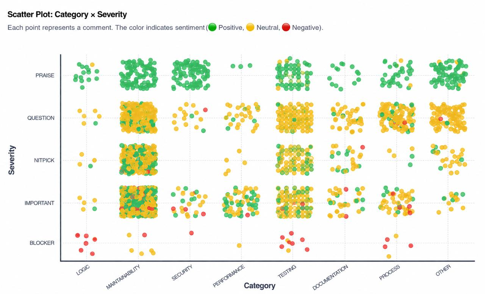
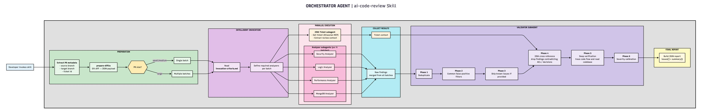
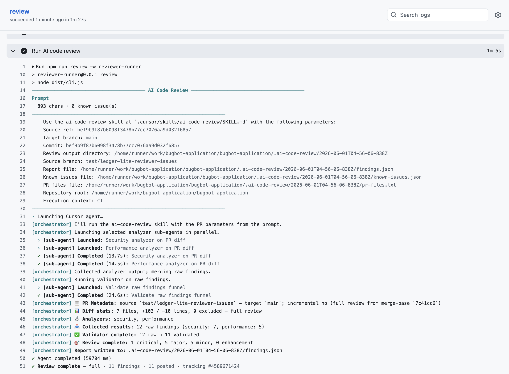
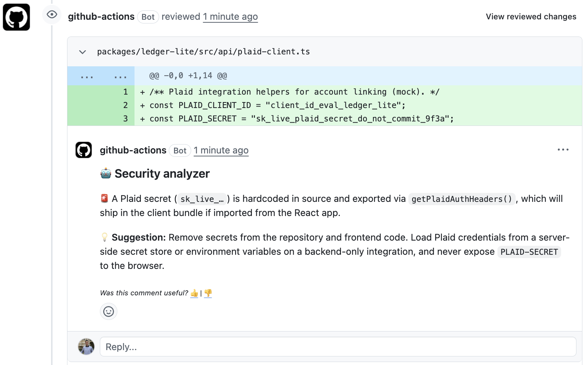
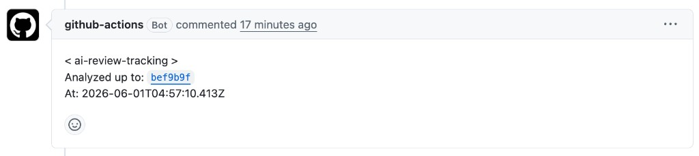
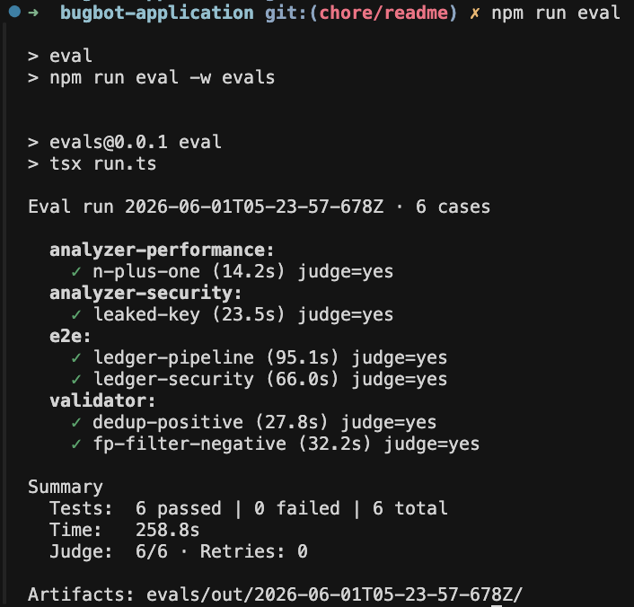

# BugBot Application

> A working AI code review system, built in a weekend to accompany my application to [Software Engineer, Bugbot](https://cursor.com/careers/software-engineer-bugbot) at Cursor.

## Table of contents

- [Project structure](#project-structure)
- [Why I built this](#why-i-built-this)
- [How I started with AI Code Review](#how-i-started-with-ai-code-review)
- [How it evolved](#how-it-evolved)
- [Features](#features)
  - [1. Local & CI execution](#1-local--ci-execution)
  - [2. Intelligent analyzer sub-agents](#2-intelligent-analyzer-sub-agents)
  - [3. Observability](#3-observability)
  - [4. Incremental reviews](#4-incremental-reviews)
  - [5. Large PR batching](#5-large-pr-batching)
  - [6. Validation funnel](#6-validation-funnel)
  - [7. Feedback system](#7-feedback-system)
- [Evals](#evals)
- [How I built this in 2 days](#how-i-built-this-in-2-days)
- [Related projects I'm building at Semble](#related-projects-im-building-at-semble)
  - [Bug Analysis Pipeline](#bug-analysis-pipeline)
  - [PR Onboarder](#pr-onboarder)
- [Closing](#closing)

## Project structure

```
bugbot-application/
├── .agents/                        # local dev harness (SDD + TDD)
├── .cursor/
│   ├── skills/ai-code-review/       # core review logic (orchestrator skill)
│   └── agents/                     # AI review sub-agents
├── evals/                          # golden-case regression harness
└── packages/
    ├── ledger-lite/                # fixture app (mock project for reviews)
    └── reviewer-runner/            # CI wrapper (tracking, inline PR comments)
```

## Why I built this

Last Friday I saw the Bugbot role posted and my immediate reaction was: *this is exactly what I want to do*. I've spent the last year building AI code review systems, agent harnesses, and developer integrations at [Semble](https://www.semble.io/), and the job description read like a mirror of my daily work.

A CV can list experience, but it can't convey the level of enthusiasm I have for this specific role and team. So instead of just applying, I decided to build something. This repository is a self-contained AI code review system for GitHub PRs, designed, implemented, and tested in a weekend, that demonstrates how I think about the exact problems Bugbot solves: precision over noise, extensible architecture, eval-driven quality, and shipping end-to-end from pipeline to adoption.

---

## How I started with AI Code Review

About a year ago I came across [Uber Engineering's article on UReview](https://www.uber.com/us/en/blog/ureview/), their AI code reviewer. It immediately clicked: I wanted to build something like this for Semble.

But before writing any code, I needed to understand where human reviews were falling short. Where could AI add the most value? To answer that, I built an **AI-powered comment analysis pipeline** that processed ~3,000 human comments left across 1,000 pull requests in Bitbucket, classifying each one by category, severity, and sentiment.

The result was a scatter plot like this:

<p align="center">
  
</p>

My first instinct was: *"Maintainability, testing, and process are the most commented categories. We should build those analyzers first."* But then I remembered [this iconic image](https://upload.wikimedia.org/wikipedia/commons/thumb/b/b2/Survivorship-bias.svg/1280px-Survivorship-bias.svg.png) and realized we were looking at a textbook case of **survivorship bias**. The categories with the most human comments weren't the gaps; they were the areas humans were *already* good at catching.

We needed to reinforce the areas where the human eye was weakest. So the first version shipped with analyzers for **Logic**, **Security**, and **Performance**.

---

## How it evolved

Since that first version, the system has grown into an **orchestrator-based architecture** with specialized sub-agents, a multi-phase validation funnel, and inline PR comments, currently used by ~70 engineers at Semble.

The core design insight has stayed the same: separate domain analysis (security, performance, logic) from validation and post-filtering, so each layer can evolve independently and the team can extend coverage by adding analyzers without touching core plumbing. This repository is a clean-room rebuild of that architecture for GitHub, runnable both locally in Cursor and as a GitHub Actions CI pipeline.

<p align="center">
  
</p>

---

## Features

### 1. Local & CI execution

All review logic (orchestration, diff preparation, analyzer invocation, validation) lives in `.cursor/skills/ai-code-review/`, which acts as the single source of truth. This skill can be invoked locally inside Cursor or from CI through a runner wrapper (`packages/reviewer-runner/`) that handles incremental scoping, tracking comments, and posting inline findings to the PR.

<details>
<summary><strong>Local</strong></summary>
<br>

https://github.com/user-attachments/assets/a0401872-cedf-46c1-bc09-b65ca5ae3ecb

</details>

<details>
<summary><strong>CI</strong></summary>
<br>

See a [real PR with findings](https://github.com/facundotolosa/bugbot-application/pull/15).

<p align="center">
  
</p>

<p align="center">
  
</p>

</details>

### 2. Intelligent analyzer sub-agents

The system routes analysis through specialized sub-agents (security, performance) that are launched based on PR content. Analyzers are invoked selectively using deterministic heuristics: if a PR only touches markdown, there's no reason to run a performance analyzer.

Each sub-agent is defined in [`.cursor/agents/`](.cursor/agents/) and the invocation criteria for each one lives in a single reference file ([`invocation-criteria.md`](.cursor/skills/ai-code-review/references/invocation-criteria.md)) that the orchestrator evaluates against the diff.

This is the same extensibility model that has worked well at Semble: the team has been able to add new analyzers to the system without modifying the orchestration layer. The analyzer is the unit of extensibility.

### 3. Observability

Every review run (local and CI) produces a timestamped artifact directory under `.ai-code-review/` containing the full trace of the pipeline: prompts, inter-agent communication files, tool calls, thinking blocks, etc. For example:

```
.ai-code-review/<timestamp>/
  run-artifacts/
    orchestrator.json              # full SDK conversation (prompts, tool calls, thinking)
    manifest.json
    session/
      diff.json                    # prepared diff sent to analyzers
      security-findings.json       # security sub-agent output
      performance-findings.json    # performance sub-agent output
      raw-findings.json            # merged pre-validation
      validator-summary.json       # validation funnel stats
    subagents/
      security-analyzer.json
      performance-analyzer.json
```

This is essential for understanding agent decisions, tuning behavior, and improving the tool. Even a minimal change to the system (a prompt tweak, a new invocation rule) can shift how agents behave, and without full observability there's no way to diagnose regressions or measure improvements.

### 4. Incremental reviews

When a PR receives new pushes after an initial review, the system only analyzes what changed since the last review, not the entire PR again. This avoids duplicate findings and keeps reviews fast and relevant.

To track the last reviewed commit, this demo stores a tracking comment directly in the PR instead of relying on persistent storage. The runner reads this comment on each run to determine the `since-commit`, scopes the diff accordingly, and updates the comment after the review completes.

<p align="center">
  
</p>

### 5. Large PR batching

> Not included in this demo.

The production system at Semble handles large PRs by splitting the diff into smaller, coherent batches before sending them to the analyzers. This prevents oversized diffs from flooding the agent's context window, where signal gets lost and analysis quality degrades. Each batch is reviewed independently and findings are merged back into a single report.

### 6. Validation funnel

Raw findings from all analyzers pass through a dedicated validator sub-agent that runs a 5-phase funnel before anything gets posted:

1. **Dedup**: Collapse findings that share the same root cause across analyzers.
2. **False-positive filters**: Apply cheap heuristic checks to drop obvious noise.
3. **Known-issue skip**: Remove findings that match comments already posted in previous reviews.
4. **Deep verification**: Trace each surviving finding through the code to confirm it's real.
5. **Severity calibration**: Adjust severity levels based on actual impact before final output.

The production system at Semble adds an extra layer: a sub-agent fetches the related Jira ticket via the Atlassian MCP, pulls comments and linked documentation, and summarizes the decisions made. This context feeds into the validation funnel as an additional filter, preventing the system from flagging business logic choices that were explicitly decided in the ticket.

### 7. Feedback system

The first version at Semble included a footer on each comment asking developers to rate the finding from 0 to 10. On paper it sounded great. In practice, after the first round of analysis, only ~5% of comments had received a vote. Asking someone to think of a number for every single finding was too much friction.

That was a valuable lesson: the best feedback mechanism is the one people actually use. While most developers ignored the voting system, many were replying directly to the bot in the comment thread, which turned out to be far more useful. Instead of just a score, we got the *reason* behind the feedback.

For this demo, the footer is simplified to a *"Was this comment useful? 👍 | 👎"*.

---

## Evals

The eval harness in this POC is intentionally simple, but it demonstrates the mental model I apply to evaluation: it's fundamentally the same as traditional software testing. You test the whole system end-to-end, and you test individual components in isolation.

The harness has two layers:

- **Deterministic tests** (`npm test -w evals`): fast, no LLM. They validate harness plumbing, schemas, prompt parity with production, and input seeding. Runs in seconds and is suitable for CI on every PR.
- **LLM golden evals** (`npm run eval`): slow, uses real agents plus an LLM-as-judge to verify the system actually catches the bugs it should. Six golden cases across four suites.

**Component evals**:

- Does the security analyzer catch a hardcoded API key?
- Does the performance analyzer flag an N+1 loop?
- Does the validator deduplicate 3 near-identical findings into 1?
- Does the validator drop false positives (placeholder keys, test-file nits) while keeping real issues?

**E2E evals**:

- Does the entire system find a leaked Plaid secret in ledger-lite?
- Does the entire system catch an N+1 in a ledger-lite export API?

<p align="center">
  
</p>

In practice, evals are the regression safety net for the review pipeline. A small change to a prompt, invocation rule, or model can alter agent behavior in ways that are hard to spot manually. Golden cases lock in expected outcomes so we can detect precision and recall regressions before they ship, without re-breaking behaviors the system already gets right.

---

## How I built this in 2 days

Before writing any application code, I set up a lightweight development harness in [`.agents/`](.agents/AGENTS.md) that structures how I work with AI, a workflow I use daily and that I thought would be worth showing here.

The process follows **SDD (Spec-Driven Development) + TDD (Test-Driven Development)**, orchestrated through a set of agent skills:

```
/brainstorm  →  spec.md (requirements, open questions, acceptance criteria)
     ↓
/plan        →  plan.md (phased, each phase verifiable)
     ↓
/implement   →  src/ + plan phases marked done (red-green-refactor TDD)
     ↓
/validate    →  sign-off via spec checklist → Status: Done
```

Each feature was specced, planned, and implemented as a discrete unit. 10 specs shipped across the weekend, from the MVP foundation through the eval harness. The `.agents/specs/` folder is the full audit trail.

This isn't just a demo convenience, it's how I've found AI-assisted development works best: give the agent clear constraints and a verifiable plan, then let it execute with TDD as a guardrail. The result is faster iteration with higher confidence.

---

## Related projects I'm building at Semble

These are other systems I've built that are directly relevant to the Bugbot role:

### Bug Analysis Pipeline

Inspired by [Zalando's post on AI-powered postmortem analysis](https://engineering.zalando.com/posts/2025/09/dead-ends-or-data-goldmines-ai-powered-postmortem-analysis.html), this pipeline mines resolved bugs from history to learn patterns the team keeps hitting.

1. **Extract** resolved bugs from Jira.
2. **Filter and enrich** with deterministic cleanup plus a script that adds structured fields.
3. **Analyze in the codebase** with an agent that receives full bug context and navigates the repo and git history to label category, root cause, detection pattern, and related signals.

The output is a report where bugs cluster by shared category, root cause, and pattern.

Today that feeds two paths:

1. **Clear detection patterns for the AI reviewer**, so the same failure modes get caught earlier in PR review.
2. **Proactive bug hunting** in the codebase from those patterns. A quick POC scan surfaced **5 existing bugs** that had never been reported.

### PR Onboarder

When a pull request moves to **Ready for review**, the system posts to the team's code review channel a summary generated by an LLM from the PR diff and the linked ticket context. Authors are @mentioned as reviewers so the right people are pulled in immediately.

On later pushes, it posts short summaries of what changed so reviewers can catch up without re-reading the full diff, tightening the feedback → fix → re-review loop.

**Reviewer assignment** uses a fair-rotation algorithm so developers review roughly similar amounts of code over time, while still respecting domain ownership when picking who should look at a given PR.

---

## Closing

This demo is a slice of what I've been building for a year: AI review that earns trust. The [Software Engineer, Bugbot](https://cursor.com/careers/software-engineer-bugbot) role is exactly what I want to do next. If you're on the team, I'd love to talk.

Thanks for reading!
